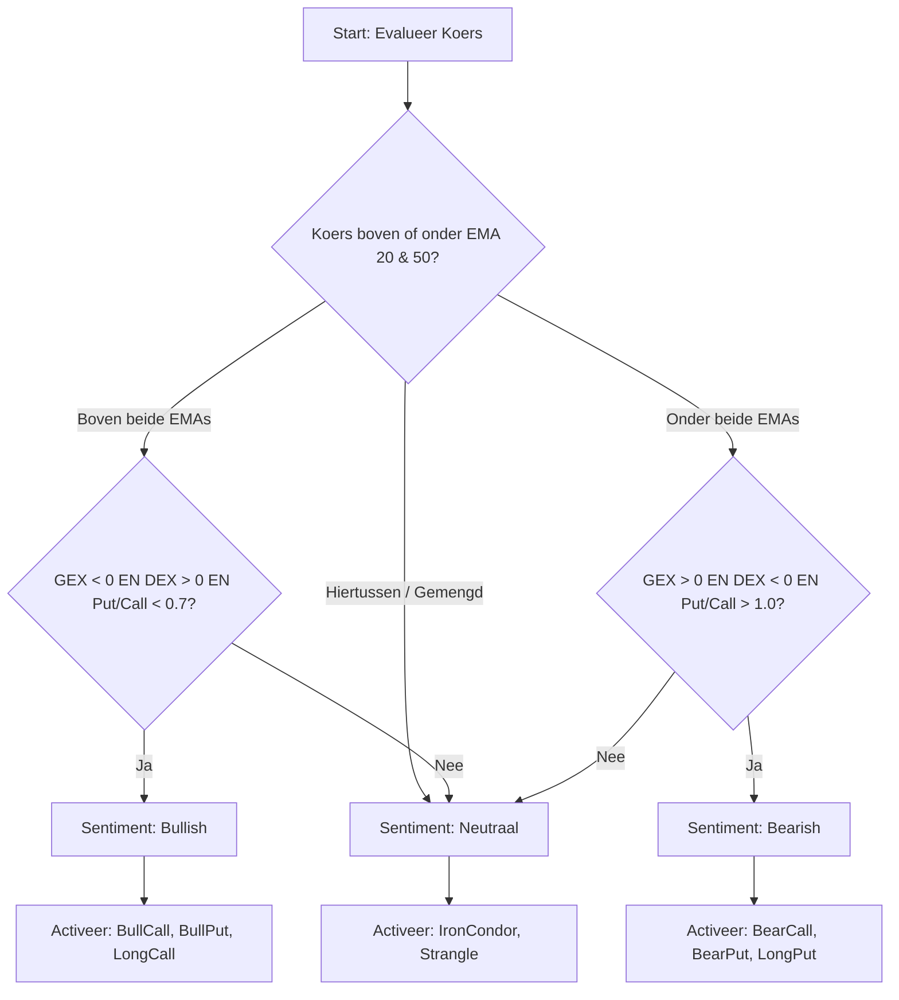

# 📖 Gebruikershandleiding: AntiGravity Optie Contract Selectie Tool

Welkom bij de handleiding voor de **AntiGravity Optie Contract Selectie Tool**! Deze handleiding is speciaal geschreven voor familieleden en beleggers die weinig tot geen ervaring hebben met opties. In begrijpelijke taal leggen we uit hoe het programma werkt, wat de knoppen betekenen en hoe de ingebouwde 'intelligente filters' helpen om de veiligste en meest winstgevende optiecontracten te selecteren.

---

## 1. Wat doet deze tool in het kort?

Opties zijn contracten waarmee je kunt profiteren van koersstijgingen, koersdalingen of zelfs wanneer een aandeel zijwaarts beweegt. Het selecteren van de juiste opties is normaal gesproken ingewikkeld rekenwerk. 

Deze tool doet al het zware werk voor je. Hij maakt rechtstreeks verbinding met de handelssoftware van **Interactive Brokers (TWS / Lynx)**, haalt live koersen en statistieken op van honderden opties, berekent de risico's met geavanceerde wiskundige modellen en toont de absolute topselectie (de beste combinaties) op je scherm.

### Wat is een 'Vertical Spread'?
De scanner zoekt voornamelijk naar **Vertical Spreads**. Dit is een beproefde methode waarbij je tegelijkertijd één optie koopt en één optie verkoopt op hetzelfde aandeel. 
* **Waarom doen we dit?** Door een optie te verkopen, dek je de kosten van de gekochte optie grotendeels af. Hierdoor is je maximale verlies vooraf exact bekend en beperkt. Het is een veel veiligere manier van handelen dan het kopen van losse opties.

---

## 2. Uitleg van de Knoppen en Instellingen (Sidebar)

Aan de linkerkant van het scherm (de sidebar) vind je alle instellingen waarmee je de scanner aanstuurt. Hieronder leggen we per onderdeel uit wat het doet.

### 🔌 TWS Instellingen (Verbinding)
* **Host / Poort / Client ID**: Dit zijn de technische adresgegevens om te verbinden met je handelsplatform (TWS of Lynx). Standaard staat de poort op `7497` (simulatie/schaduw-account). Als je live wilt handelen, gebruik je meestal `7496`.
* **Gebruik Real-Time Data**: Vink dit aan als je een live data-abonnement hebt bij Interactive Brokers. Als dit uit staat, gebruikt het programma historische of vertraagde koersen (handig voor in het weekend).
* **Test Verbinding & Opslaan**: Klik hierop om te controleren of de app succesvol verbinding kan maken met je TWS-handelsplatform.

### 🔮 Strategie Instellingen (Jouw Marktvisie)
* **Marktvisie**: Hier geef je aan wat je verwacht dat de beurs gaat doen:
  * **Bullish (Stijgend)**: Je verwacht dat de koers omhoog gaat. De tool activeert strategieën die geld opleveren bij stijging (zoals *Bull Put* en *Bull Call* spreads).
  * **Bearish (Dalend)**: Je verwacht dat de koers omlaag gaat. De tool activeert dalende strategieën (*Bear Call* en *Bear Put* spreads).
  * **Neutraal (Zijwaarts)**: Je verwacht dat de koers stabiel blijft. De tool zoekt naar spreads die winst maken zolang de koers binnen een bepaalde bandbreedte blijft (*Iron Condor* en *Strangle*).
* **Specifieke Strategieën (Vinkjes)**: Hier kun je handmatig bepaalde optie-combinaties aan- of uitzetten om je scan te verfijnen.

### 🚀 Scan Modus (Wat gaan we scannen?)
* **Enkel Symbool**: Typ één aandeel in (bijv. `SPY` voor de S&P 500 ETF of `AAPL` voor Apple) om direct te scannen.
* **Batch Scan (Lijst / Bestand)**: Scan een hele groep aandelen tegelijk, bijvoorbeeld de "Top 10 Tech" aandelen, of upload je eigen lijst via een Excel- of CSV-bestand.
* **BarChart Optie Flow (CSV)**: Hiermee kun je bestanden inladen van Barchart om te zien waar grote professionele partijen ("Smart Money") momenteel gigantische orders plaatsen. Het programma vertaalt deze orders automatisch naar veilige spreads.
* **Live TWS Scanner**: Laat TWS zelf zoeken naar de meest actieve aandelen van dit moment en scant deze direct.
* **Auto-Pilot (Downloads map)**: De 'automatische piloot'. Je stelt een tijd in (bijvoorbeeld 10 minuten na beursopening). De app wacht rustig af, laadt automatisch de nieuwste symbolenlijst in en start de scan op het gekozen tijdstip.

### 📉 Filters & Criteria (Jouw Veiligheidsmarges)
* **Dagen tot Expiratie (DTE)**: Hoe lang de opties moeten lopen. Standaard zoeken we tussen de **5 en 32 dagen**. Hoe korter de looptijd, hoe sneller je winst (of verlies) maakt.
* **Spread Breedte**: Het verschil in uitoefenprijs tussen de twee opties in je spread. Standaard is dit `$10`. Een grotere breedte betekent meer winstpotentieel, maar ook een groter maximaal risico.
* **Min Kans op Winst (PoP %)**: *Probability of Profit*. De minimale kans dat deze trade met winst eindigt. Zet dit bijvoorbeeld op 60% of 70% om riskante trades direct uit te sluiten. 
  * *Hoe berekent de tool dit?* De tool gebruikt de Delta van de dichtstbijzijnde optie-strike (de uitoefenprijs die het dichtst bij de huidige aandelenkoers ligt).
    * Voor **Credit Spreads** (waar je premie ontvangt, zoals de Bull Put en Bear Call) is de winstkans: `(1.0 - abs(Delta)) * 100%`.
    * Voor **Debit Spreads** (waar je premie betaalt, zoals de Bull Call and Bear Put) is de winstkans: `abs(Delta) * 100%`.
* **Min Winst Potentie ($)**: Het minimale bedrag dat je met de spread wilt verdienen (bijv. minimaal `$100` per contract).
* **Max Pain Buffer (Punten)**: De minimale afstand (in dollars) die je spread moet behouden tot de zogenaamde 'Max Pain' prijs (zie uitgebreide uitleg hieronder). Standaard is dit `5` punten voor extra veiligheid.

### 🎯 Koopadvies Instellingen (Het Selectiemodel)
* **Koopadvies Drempel (p %)**: Dit is een slimme filterregel. Als je deze instelt op `1.0%`, betekent dit dat het aandeel hooguit 1% in de voor jou verkeerde richting hoeft te bewegen om de maximale winst binnen te halen. Veel spreads staan bij het afsluiten al direct in de winstzone (Out-of-the-Money)!
* **Strike Range (Afstand tot Koers %)**: Bepaalt hoe ver we onder of boven de huidige koers zoeken. Een positieve waarde van `30.0%` zoekt naar spreads die maximaal 30% verwijderd liggen van de huidige aandelenkoers.
* **Min. Afstand tot Koers %**: De minimale buffer. Hiermee voorkom je dat de uitoefenprijzen te dicht op de huidige koers liggen, zodat je een foutmarge behoudt.
* **ITM Veiligheidsmarge (Support Niveau)**: Hier kies je hoe conservatief je wilt positioneren. Je kunt kiezen voor een marge gebaseerd op de **Expected Move** (de verwachte beweging op basis van de beweeglijkheid van het aandeel). Kies bijvoorbeeld *Niveau 2 (2x Expected Move)* om je uitoefenprijzen extra ver weg en veilig te leggen.

### ⚙️ Greeks & Technische Filters
* **Min Delta (Short Leg)**: Filtert opties op basis van hun 'Delta' (de gevoeligheid voor koersbewegingen).
* **Filter op EMA Trend**: Vink dit aan om alleen aandelen te verhandelen die in een gezonde trend bewegen. Je kunt filteren op de **EMA 8** (korte trend), **EMA 50** (middellange trend) of **EMA 150** (lange trend). Bij een stijgende marktvisie scant het programma alleen aandelen waarvan de koers *boven* deze gemiddelden ligt.
* **Filter op Stoch RSI Entry**: Stochastic RSI is een indicator die aangeeft of een aandeel 'oververhit' is (te veel gekocht) of juist 'goedkoop' (oververkocht). De tool heeft 3 ingebouwde entry-signalen (Entry A, B en C) om het perfecte instapmoment te timen (bijvoorbeeld een opwaartse kruising in de goedkope zone).

---

## 3. Uitgebreide Uitleg: Complexe Parameters & Indicatoren

Sommige parameters in het programma zijn wat complexer, maar ze zijn cruciaal omdat ze de 'hersenen' van het selectieproces vormen. Hieronder leggen we ze eenvoudig uit.

### 1. Max Pain (Maximale Pijn)
* **Wat is het?** Grote partijen en banken verkopen (schrijven) de meeste opties. Op de dag dat de opties aflopen (expiratie), is er één specifieke koers waarbij de meeste gekochte opties van particuliere beleggers waardeloos aflopen. Dit noemen we het **Max Pain** niveau: het punt dat de meeste 'pijn' (verlies) veroorzaakt bij kopers, en dus de maximale winst oplevert voor de banken.
* **Beslissing**: Omdat aandelenkoersen rond expiratie vaak als een magneet naar dit Max Pain punt toe worden getrokken, wil je hier met je spreads rekening mee houden. 
* **Indicator in de tool**: 
  * `max_pain` (Max Pain 1) & `max_pain_selection` (Max Pain 2) tonen deze sleutelniveaus.
  * `MP Buffer OK` (vinkje) controleert of jouw uitoefenprijzen minimaal **5 punten** verwijderd zijn van dit niveau, zodat je niet geraakt wordt door deze prijsmagneet.

### 2. GEX (Gamma Exposure)
* **Wat is het?** GEX meet hoeveel aandelen de market makers (grote banken) moeten kopen of verkopen om hun eigen risico's af te dekken.
  * **Positieve GEX (GEX > 0)**: Werkt als een **schokdemper**. De markt is rustig, koersuitslagen worden gedempt en de koers blijft stabiel.
  * **Negatieve GEX (GEX < 0)**: Werkt als een **gaspedaal**. Koersuitslagen worden versterkt. Als de beurs daalt, dalen aandelen extra snel; als ze stijgen, stijgen ze extra hard. Dit is de zone van hoge beweeglijkheid (volatiliteit).
* **Indicator in de tool**:
  * `Huidige GEX` (invoer): Negatief is gunstig voor snelle, krachtige trendbewegingen (momentum).
  * `gamma_flip`: Het prijsniveau waarop de markt omslaat van rustig (schokdemper) naar wild (gaspedaal).
  * `gex_wall`: De uitoefenprijs met de allergrootste gamma-waarde. Dit fungeert als een belangrijk plafond of bodem waar de koers moeilijk doorheen breekt.

### 3. DEX (Delta Exposure)
* **Wat is het?** DEX meet de richting van de posities die beleggers hebben ingenomen. Het geeft het sentiment van de markt weer.
  * **Positieve DEX (DEX > 0)**: Beleggers hebben overwegend stijgende posities (Calls) openstaan. Dit duidt op een **optimistisch (Bullish)** marktsentiment.
  * **Negatieve DEX (DEX < 0)**: Beleggers hebben overwegend dalende posities (Puts) openstaan. Dit duidt op een **pessimistisch (Bearish)** marktsentiment.
* **Indicator in de tool**:
  * `Huidige DEX` (invoer): Wordt door het sentiment model geëvalueerd om te bepalen of het marktklimaat geschikt is voor stijgende of dalende trades.

### 4. Het Automatische Sentiment Model
Dit model is een ingebouwde beslissingsboom die voorkomt dat je tegen de stroom in zwemt. Het kijkt naar de trend én naar de marktstructuur om de actieve strategieën automatisch aan te passen:

* **Hoe werkt dit in de praktijk?** Zelfs als je in de sidebar hebt aangegeven dat je "Bullish" bent, zal het model de scan verfijnen naar Neutraal of Bearish als de indicatoren (GEX/DEX/EMAs) negatief zijn. Zo word je beschermd tegen te enthousiaste aankopen in een dalende markt.

### 5. Ranking Prioriteit (Sorteren van resultaten)
Als de scan klaar is, heeft de tool vaak tientallen spreads gevonden. De **Ranking Prioriteit** bepaalt welke bovenaan komen te staan:
* **AG Score (AntiGravity Score)**: Dit is onze 'super-sorteerder'. Het is een gewogen cijfer dat rekening houdt met:
  1. *Kans op winst (PoP)* (hoe hoger, hoe beter).
  2. *Risico-efficiëntie (TEI Score)* (hoe sneller de winst kan worden gehaald, hoe beter).
  3. *Koopadvies Bonus*: Geeft een **1.5x bonus** als de trade voldoet aan de 1% drempelregel.
  4. *Max Pain Buffer*: Geeft een **1.2x bonus** als de strikes veilig wegblijven van het Max Pain niveau.
  5. *Afstand tot Break-Even*: Beloont diepere veiligheidsmarges (verre break-even punten).
  6. *Koers-boete*: Geeft strafpunten als de optie gevaarlijk dicht op de huidige aandelenkoers ligt.
* **Profit / PoP / Theta**: Je kunt ook puur sorteren op de hoogste winst (`Profit`), de hoogste winstkans (`PoP`), of de snelheid waarmee de optie zijn tijdswaarde verliest ten gunste van jou (`Theta`).

### 6. Delta Koers
* **Wat is het?** Delta Koers is een indicator die de directe prijsgevoeligheid en de versnelling van de spread combineert: `abs(Net Delta) + Net Gamma`.
* **Waarom gebruiken we dit?** Het geeft aan hoe dynamisch de spread reageert per dollar die het onderliggende aandeel beweegt. Hoe hoger dit getal, hoe sneller de spread winst (of verlies) opbouwt bij een gunstige (of ongunstige) koersbeweging.

### 7. Sluitingswinst (EM - Expected Move)
* **Wat is het?** De geschatte winst (of verlies) in dollars als je de spread vervroegd sluit (bijvoorbeeld na 5 dagen, of halverwege de looptijd bij kortere contracten), aannemende dat het aandeel met **1 Expected Move** (de statistisch verwachte koersbeweging) in de voor jou gunstige richting beweegt.
* **Waarom is dit nuttig?** Hierdoor kun je inschatten of het de moeite waard is om de trade vroegtijdig te sluiten. Vaak kun je door het verstrijken van de tijd en een kleine gunstige beweging al 70-80% van de maximale winst binnenhalen lang voordat de expiratiedatum is bereikt.

---

## 4. Technische Indicatoren die op de Achtergrond Meelopen

Wanneer je met de filters werkt, rekenen de volgende indicatoren continu met je mee om de kwaliteit van de spreads te beoordelen:

1. **EMA 8, 50, 150 (Voortschrijdende Gemiddelden)**:
   * *Wat het doet*: Berekent de gemiddelde koers over de afgelopen 8, 50 of 150 dagen. Dit toont de trend. Ligt de huidige koers boven de EMA 150? Dan is het aandeel op de lange termijn stabiel en stijgend.
2. **Stochastic RSI (14, 9, 3, 6)**:
   * *Wat het doet*: Meet momentum en oververhitting. De blauwe lijn (%K) en rode lijn (%D) bewegen tussen 0 en 100. Een kruising van de blauwe lijn boven de rode lijn onder het niveau van 20 is een klassiek koopsignaal (Entry A: bodemvisser).
3. **ATR(10) (Average True Range)**:
   * *Wat het doet*: Berekent de gemiddelde dagelijkse beweging (beweeglijkheid/volatiliteit) van het aandeel over de laatste 10 dagen. Als een aandeel een ATR van `$3` heeft, beweegt het gemiddeld 3 dollar per dag omhoog of omlaag.
4. **TTP (Time-to-Profit / Dagen tot Winst)**:
   * *Wat het doet*: Berekent op basis van de ATR(10) hoeveel dagen het aandeel er statistisch over zal doen om een koerswinst van `$5` te behalen.
5. **TEI Score (Trade Efficiency Index)**:
   * *Wat het doet*: Een geavanceerde score uit het Bjerksund-Stensland model. Het meet of de verhouding tussen de winstdoelstelling en het risico dat de optie vroegtijdig wordt uitgeoefend optimaal is. Een score > 1.2 is zeer efficiënt.
6. **Expected Move (1SD - Standaarddeviatie)**:
   * *Wat het doet*: Berekent de statistisch verwachte bandbreedte waarin het aandeel zal blijven tot de expiratiedatum, gebaseerd op de Impliciete Volatiliteit (IV). Ongeveer 68% van de tijd blijft de koers binnen deze grenzen.

---

## 5. Drie Praktische Instellingsvoorbeelden

Om direct aan de slag te gaan, volgen hier drie concrete voorbeelden van hoe je de tool kunt instellen en wat het resultaat is.

### Voorbeeld 1: De "Veilige Belegger" (Rustig inkomen genereren)
* **Doel**: Met een zeer hoge winstkans en ruime marges premie ontvangen op een stabiel aandeel (bijv. `SPY`).
* **Instellingen**:
  * *Marktvisie*: Bullish (Stijgend)
  * *Strategie*: **Bull Put Spread** (je ontvangt direct geld bij het openen van de trade)
  * *DTE*: 20 tot 32 dagen
  * *Spread Breedte*: `$10`
  * *Min. Kans op Winst (PoP)*: `75%`
  * *ITM Veiligheidsmarge*: *Niveau 2 (2x Expected Move)* (zeer ver weg)
  * *Max Pain Buffer*: Aan (vinkje)
  * *Sorteer op*: `AG Score`
* **Het Resultaat**: De scanner toont een Bull Put spread waarbij de uitoefenprijzen heel ver onder de huidige koers liggen (bijvoorbeeld koers is $500, uitoefenprijzen liggen op $460/$450). De kans dat de koers onder de $460 zakt in 3 weken is statistisch erg klein. Je wint als de koers stijgt, zijwaarts beweegt, of zelfs een beetje daalt. De ontvangen premie is wat lager (bijv. $120), maar de winstkans is extreem hoog (~80%).

### Voorbeeld 2: De "Momentum Jager" (Profiteren van een sterke trend)
* **Doel**: Maximale winst behalen op een aandeel dat hard stijgt (bijv. `NVDA`), met een strakke timing.
* **Instellingen**:
  * *Marktvisie*: Bullish (Stijgend)
  * *Strategie*: **Bull Call Spread** (je betaalt premie, maar hebt een groter winstpotentieel)
  * *DTE*: 8 tot 15 dagen (kort op de bal)
  * *Spread Breedte*: `$5`
  * *Filter op EMA Trend*: Aan (Prijs > EMA 8 en EMA 50)
  * *Filter op Stoch RSI Entry*: Aan (Entry A of Entry B geselecteerd)
  * *Sorteer op*: `Profit`
* **Het Resultaat**: De tool zoekt naar een moment waarop NVDA net uit een dipje klimt (bevestigd door de Stoch RSI en EMA trend). Hij stelt een Bull Call spread voor die dicht op de huidige koers ligt (bijv. koers is $900, uitoefenprijzen $900/$905). Dit contract kost je bijvoorbeeld $220 om te kopen, maar kan maximaal $500 waard worden (winst van $280). Het risico is beperkt tot je inleg ($220) en je profiteert optimaal van de opwaartse sprint.

### Voorbeeld 3: De "Zijwaartse Premiezoeker" (Profiteren van rust)
* **Doel**: Geld verdienen aan het verstrijken van de tijd, zolang een aandeel (bijv. `AAPL`) binnen een rustige bandbreedte blijft schommelen.
* **Instellingen**:
  * *Marktvisie*: Neutraal (Zijwaarts)
  * *Strategie*: **Iron Condor** (een combinatie van een Bull Put en een Bear Call spread)
  * *DTE*: 25 tot 35 dagen
  * *Spread Breedte*: `$10`
  * *Min. Kans op Winst (PoP)*: `65%`
  * *Sorteer op*: `AG Score`
* **Het Resultaat**: De tool stelt een Iron Condor voor waarbij de grenzen heel ruim liggen. Bijvoorbeeld bij een Apple koers of $175 liggen de verkoopgrenzen op $160 (onderkant) en $190 (bovenkant). Zolang Apple over een maand tussen de $160 en $190 noteert, loopt de trade maximaal winstgevend af en behoud je de volledige ontvangen premie (bijv. $300). De AG Score zorgt ervoor dat deze grenzen buiten de belangrijkste steunniveaus (Put Wall) en weerstanden (Call Wall) liggen.

---

## 6. Het Plaatsen van een Order (Stappenplan)

Wanneer je een mooie spread hebt gevonden in het tabblad **📊 Resultaten**:
1. Selecteer het contract in de dropdown-lijst onder de tabel. Er staat nu een groen vinkje bij.
2. Ga bovenin naar het tabblad **🛒 Orders**. Je ziet hier alle details van de geselecteerde spread netjes klaargezet.
3. Vul het **Aantal Contracten** in dat je wilt kopen (standaard 1).
4. De **Limiet Prijs** staat automatisch ingevuld met de 'Laatprijs' (de meest realistische marktprijs). 
   * *Let op*: Bij credit spreads (waar je geld ontvangt, zoals de Bull Put spread) staat hier een **negatief getal** (bijv. `-1.20`). Dit hoort zo! Dit geeft aan TWS door dat je minimaal $1,20 wilt ontvangen voor de spread.
5. Kies bij Order Type voor **Adaptive - Normal** (dit is de standaardinstelling). De computer van TWS gaat dan automatisch binnen de bied- en laatprijs onderhandelen om de allerbeste prijs voor jou te scoren.
6. Klik op de grote knop **PLAATS ORDER**. De order wordt direct naar Interactive Brokers gestuurd en is zichtbaar in je TWS-scherm onder het tabblad 'Orders'.

## 7. Functie Onderzoek Filters & Criteria (Winst-onderzoek)

Om te voorkomen dat je "blind" filters moet instellen zonder te weten wat de effecten zijn op je rendement, bevat de tool de module **Functie onderzoek Filters & Criteria**. Dit is een krachtige, ingebouwde onderzoeksmodule die je helpt om te bepalen welke instellingen statistisch gezien de beste resultaten opleveren.

### Wat doet dit onderzoek?
Wanneer je in de zijbalk op de knop **🔬 Functie onderzoek F&C** klikt, start het programma een geautomatiseerde analyse over **16 verschillende selectieparameters**. 
Het programma haalt live marktgegevens op (bijvoorbeeld van de index `SPY`) en berekent via de ingebouwde wiskundige rekenmodellen (Bjerksund-Stensland) voor honderden optie-combinaties wat het effect is van het wijzigen van die specifieke parameter.

De tool onderzoekt onder andere:
* **Spreadbreedte**: Welke breedte (bijv. $5, $10, $15) geeft de beste verhouding tussen risico en rendement?
* **Kans op winst (PoP)**: Wat is de invloed van een hogere winstkans op de uiteindelijke premie?
* **ITM Veiligheidsmarge**: Welk niveau van de Expected Move (Niveau 1, 2 of 3) beschermt het beste tegen onverwachte marktcrashers?
* **Marktsentiment (GEX/DEX/Put-Call)**: Welke strategieën werken het best onder welke sentimentomstandigheden?

### Hoe gebruik je het?
1. Klik in het zijpaneel op de knop **🔬 Functie onderzoek F&C**. Er opent een pop-up venster.
2. Kies de gegevensbron (de *Referentie SPY Scan* wordt aanbevolen omdat deze altijd beschikbaar is, ook in het weekend).
3. Klik op **Start Onderzoek**. Je ziet een voortgangsbalk en live logboeken die laten zien wat het programma aan het analyseren is. Dit proces duurt ongeveer 15 tot 20 seconden.
4. **Automatische Opslag**: Zodra het onderzoek is voltooid, wordt er direct een wiskundig onderbouwd Word-rapport (.docx) gegenereerd en automatisch opgeslagen in je lokale **Downloads-map** onder de naam:
   `Functie_onderzoek_filters_criteria.docx` (of `Functie_onderzoek_filters_criteria_X.docx` als het hoofdbestand al geopend is in Word).
5. **Direct openen**: Klik op de knop **📖 Open Rapport direct in Word** in de pop-up of zijbalk om het rapport meteen op je beeldscherm te openen.

### Wat staat er in het rapport?
Het gegenereerde Word-rapport is professioneel opgemaakt in een *Navy Blue* en *Charcoal* kleurschema en bevat:
* Een **Prioriteitenlijst** die de filters rangschikt op basis van hun toegevoegde waarde (Must-Have, Aanbevolen, Handig, Overbodig).
* **Gedetailleerde tabellen** per parameter met daarin het aantal gevonden spreads, de gemiddelde winst, de gemiddelde winstkans (PoP) en de gemiddelde AG Score.
* De **Top 10 spreads** die voldoen aan de optimale instelling van die parameter.
* Een concrete **Optimaal Analyse- en Selectie-Workflow** (stap-voor-stap handleiding) om je rendement te maximaliseren.

---

*Succes met het scannen en selecteren! Mocht je vragen hebben over een specifieke term, raadpleeg dan dit document of bekijk de live statistieken in de tabbladen.*
