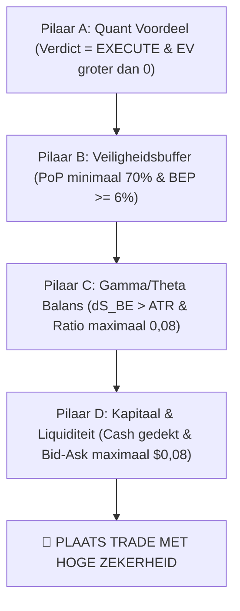
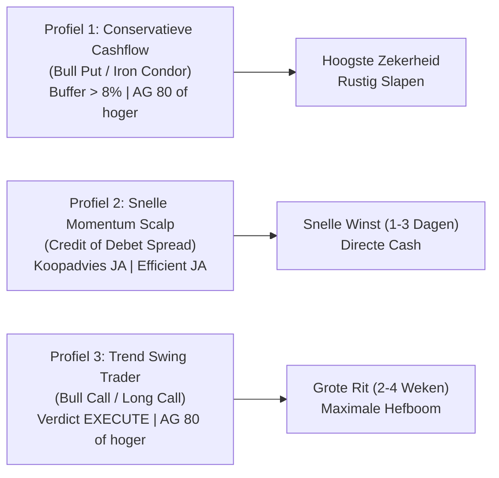

# 📖 Gebruikershandleiding: AntiGravity Optie Contract Selectie Tool

Welkom bij de handleiding voor de **AntiGravity Optie Contract Selectie Tool**! Deze handleiding is speciaal geschreven voor beleggers en familieleden die een helder, begrijpelijk inzicht willen in optiecontracten en hoe deze tool helpt om de veiligste en meest winstgevende optiecombinaties te selecteren.

---

## 1. Wat doet deze tool in het kort?

Opties zijn contracten waarmee je kunt profiteren van koersstijgingen, koersdalingen of het zijwaarts bewegen van een aandeel. Het handmatig selecteren van de juiste opties vergt normaal gesproken veel rekenwerk. 

Deze tool doet al het zware werk voor je. Hij maakt rechtstreeks verbinding met de handelssoftware van **Interactive Brokers (TWS / Lynx)**, haalt live koersen en statistieken op van honderden opties, berekent de risico's met slimme rekenmodellen en toont de absolute topselectie (de beste combinaties) overzichtelijk op je scherm.

### Wat is een 'Vertical Spread'?
De scanner zoekt voornamelijk naar **Vertical Spreads**. Dit is een beproefde methode waarbij je tegelijkertijd één optie koopt en één optie verkoopt op hetzelfde aandeel. 
* **Waarom doen we dit?** Door een optie te verkopen, dek je de kosten van de gekochte optie grotendeels af. Hierdoor is je maximale verlies vooraf exact bekend en beperkt. Het is een veel veiliger manier van handelen dan het kopen van losse opties.

> [!TIP]
> **Direct naar de Resultatenpagina & Beslisregels?** 
> Zie **[Sectie 22: De Complete Resultatenpagina Gids (Tab 2) & Het Gouden A-B-C-D Besluitvormingsmodel](#22-de-complete-resultatenpagina-gids-tab-2-resultaten)** en **[Sectie 23: De Complete Keuzetabel & Beslissingsmatrix](#23-de-complete-keuzetabel--beslissingsmatrix-alle-combinaties)** voor de volledige keuzetabel met alle 48 combinaties en concrete handelsbesluiten.

---

## 2. Uitleg van de Knoppen en Instellingen (Sidebar)

Aan de linkerkant van het scherm (de sidebar) vind je de instellingen waarmee je de scanner aanstuurt.

### 🔌 TWS Instellingen (Verbinding)
* **Host / Poort / Client ID**: De adresgegevens om te verbinden met het handelsplatform (TWS of Lynx). Standaard staat de poort op `7497` (simulatie/schaduw-account). Voor live handelen gebruik je meestal `7496`.
* **Gebruik Real-Time Data**: Vink dit aan als je een live data-abonnement hebt bij Interactive Brokers. Als dit uit staat, gebruikt de tool vertraagde of historische koersen (handig voor in het weekend).
* **Test Verbinding & Opslaan**: Controleert of de tool succesvol verbinding kan maken met het handelsplatform.

### 🔮 Strategie Instellingen (Jouw Marktvisie)
* **Marktvisie**: Hier geef je aan wat je verwacht dat de beurs gaat doen:
 * **Bullish (Stijgend)**: Je verwacht dat de koers omhoog gaat. De tool activeert strategieën die geld opleveren bij stijging (*Bull Put* en *Bull Call* spreads).
 * **Bearish (Dalend)**: Je verwacht dat de koers omlaag gaat. De tool activeert dalende strategieën (*Bear Call* en *Bear Put* spreads).
 * **Neutraal (Zijwaarts)**: Je verwacht dat de koers stabiel blijft. De tool zoekt naar spreads die winst maken zolang de koers binnen een bepaalde bandbreedte blijft (*Iron Condor* en *Strangle*).
* **Specifieke Strategieën (Vinkjes)**: Hiermee kun je handmatig bepaalde optiecombinaties aan- of uitzetten.

### 🚀 Scan Modus (Wat gaan we scannen?)
* **Enkel Symbool**: Typ één aandeel in (bijv. `SPY` voor de S&P 500 ETF of `AAPL` voor Apple) om direct te scannen.
* **Batch Scan (Lijst / Bestand)**: Scan een hele groep aandelen tegelijk, bijvoorbeeld de "Top 10 Tech" aandelen, of upload een eigen lijst via Excel/CSV.
* **BarChart Optie Flow (CSV)**: Hiermee kun je bestanden inladen van Barchart om te zien waar grote professionele partijen ("Smart Money") grote orders plaatsen. De tool vertaalt deze orders automatisch naar veilige spreads.
* **Live TWS Scanner**: Laat TWS zelf zoeken naar de meest actieve aandelen van dit moment en scant deze direct.
* **Auto-Pilot**: De automatische piloot. De tool wacht rustig af en start de scan op een door jou gekozen tijdstip.

### 📉 Filters & Criteria (Jouw Veiligheidsmarges)
* **Dagen tot Expiratie (DTE)**: Hoe lang de opties moeten lopen (standaard tussen **5 en 32 dagen**). Hoe korter de looptijd, hoe sneller het tijdswaardeverval in jouw voordeel werkt.
* **Spread Breedte**: Het verschil in uitoefenprijs tussen de twee opties in je spread (bijv. `$10`). Een grotere breedte betekent meer winstpotentieel, maar ook een groter maximaal risico.
* **Min Kans op Winst (PoP %)**: De minimale statistische kans dat een trade met winst eindigt (bijvoorbeeld ingesteld op 60% of 70%).
* **Min Winst Potentie ($)**: Het minimale bedrag dat je met de spread wilt verdienen (bijv. minimaal `$100` per contract).
* **Max Pain Buffer (Punten)**: De minimale afstand in dollars die je spread moet behouden tot de 'Max Pain' koers (de magneetprijs waar opties waardeloos aflopen).

### 🎯 Koopadvies Instellingen (Het Selectiemodel)
* **Koopadvies Drempel (1.0%)**: Een filterregel die controleert of de spread bij het afsluiten al direct in een gunstige zone ligt (Out-of-the-Money).
* **Strike Range (Afstand tot Koers %)**: Bepaalt hoe ver boven of onder de huidige koers we zoeken (bijv. maximaal 30% verwijderd).
* **ITM Veiligheidsmarge (Support Niveau)**: Kies hoe conservatief je wilt positioneren op basis van de **Expected Move** (de verwachte beweeglijkheid van het aandeel). Kies bijvoorbeeld *Niveau 2 (2x Expected Move)* om uitoefenprijzen extra ver weg en veilig te leggen.

### 🔥 Dual-Trigger Entry & Bewakende Profit Target (Nieuw)
* **🔥 Dual-Trigger Entry (Squeeze & Pullback)**: Schakel dit vinkje in om de scanner uitsluitend aandelen te laten meenemen die exact op dit moment een kwantitatieve momentum-setup tonen (gericht op minstens 80-90% winstkans):
  * **Squeeze Breakouts**: Vangt de opwaartse explosie na extreme consolidatie (Bollinger Bands trekken binnen Keltner Channels en openen opwaarts met `Close > SMA20` en `EMA5 > EMA13`).
  * **Trend Pullbacks**: Vangt vroege herstelkansen binnen een gevestigde trend (`EMA5` kruist opwaarts over `EMA13` boven de langetermijntrend `EMA34` met een groene bevestigingscandle).
  * **Signaal Versheid**: Bepaal hoe recent de breakout of pullback mag zijn (*Vandaag (0d)*, *Laatste 2 dagen*, *Laatste 3 dagen*, of *Laatste 5 dagen*).
* **🎯 Bewakende Profit Target (Exit Bewaking)**:
  * **70% van Max Winst (Aanbevolen)**: Sluit credit spreads (Bull Put) zodra 70% van de ontvangen premie winst is (terugkopen op 30% van de premie), en sluit debit spreads (Bull Call) bij 70% van de maximale spreadwinst.
  * **60% (Snel Winst Nemen)**: Sneller winst verzilveren en kapitaal vrijmaken bij hoge marktvolatiliteit.
  * **100% (Tot Expiratie Laten Lopen)**: Volledige expiratie afwachten.
  * **Trailing / EMA Kruising Exit**: Actieve bewaking die de positie sluit zodra de snelle `EMA5` onder de signaallijn `EMA13` duikt om een opgebouwde winst veilig te stellen.

---

### ⚡ De Snelle Actieknoppen: 'Reset Filters' & 'Optimaliseer'

Moet je na het opstarten of bij het kiezen van een strategie verplicht op deze knoppen drukken? **Nee, na het opstarten hoef je deze knoppen niet verplicht in te drukken.** Het programma start namelijk standaard al direct op met de gecalibreerde basisinstellingen. Toch hebben beide knoppen een heel specifieke en nuttige functie:

#### 1. Knop: `⚡ Reset Filters`
* **Wat doet deze knop?** 
 Zet met één klik alle invoervelden en schuifbalken in de zijbalk terug naar de optimale fabrieksinstellingen behorend bij het gekozen profiel (**Week** of **Maand**). Bovendien is deze knop **strategie-bewust**:
 * Staat je strategie op **Spreads** (bijv. Bull Put / Bear Call): dan zet hij de strike-afstand op **5.0% - 6.0%** en de BEP-buffer op **6.0%** (veilige Out-of-the-Money marges).
 * Staat je strategie op **puur Long opties** (bijv. alleen **Long Call** of **Long Put**): dan weet de knop dat je opties zoekt met de scherpe 1%-regel en lage BEP-afstand, en past hij de filters automatisch direct aan.
* **Wanneer gebruik je deze knop?**
 1. **Bij overschakelen naar een andere strategiefamilie** (bijv. van Spreads naar Long Call / Long Put): klik op `⚡ Reset Filters` zodat alle strikes en buffers meteen optimaal staan voor die categorie.
 2. **Na handmatig schuiven en experimenteren**: als je sliders hebt verzet (winstkans, delta, DTE, etc.) en je snel wilt terugkeren naar de bewezen basislijn.
 3. **Als een scan onverhoopt 0 trades geeft**: om eventuele te strenge handmatige filters in één keer te ontspannen.

#### 2. Knop: `🔬 Optimaliseer`
* **Wat doet deze knop?** 
 Deze knop start **geen** gewone scan voor de handelsdag van vandaag, maar opent en start een **historische Backtest & Vergelijkingstest** in Tab 6 (*Hit Rate & Optimalisatie*). Hij toetst tientallen historische trades over de afgelopen 1 à 2 jaar om te meten:
 * Wat is de werkelijke historische **Hit Rate %** van je huidige configuratie?
 * Wat is de **gemiddelde winst per trade** ($)?
 * Hoe presteert jouw instelling ten opzichte van de standaard benchmark?
* **Wanneer gebruik je deze knop?**
 1. **Voor functie-onderzoek en validatie**: als je een specifieke strategievariatie wiskundig wilt valideren op historische data.
 2. **Niet voor de dagelijkse handelsselectie**: bij je normale dagelijkse scan hoef je deze knop niet in te drukken; het is puur een onderzoeks- en optimalisatietool.

#### 3. Toggle: `🟢 🎯 Auto-Optimalisatie: ACTIEF / UIT`
* **Wat doet deze knop?**
  Het programma start na het openen **volledig automatisch** op in de **Auto-Optimalisatie** stand. In plaats van alle aandelen met één generieke sidebar-instelling te scannen, kijkt het systeem naar het specifieke gedrag van elk aandeel:
  * **Aandeel-specifieke parameters**: Gebruikt automatisch de meest winstgevende Expected Move buffer (bijv. 1.10x voor lage volatiliteit vs. 1.65x voor snelle groeiers zoals NVDA), de optimale spread-breedte ($5, $10 of $15) en het ideale DTE-venster.
  * **Auto-Refresh bij veroudering (>30 dagen)**: Is een aandeel nieuw of is de laatste optimalisatiesweep ouder dan 30 dagen? De scanner voert tijdens het scannen direct een snelle achtergrond-sweep uit (15–20 seconden) en slaat het nieuwe optimum permanent op in `stock_profiles.json`.
  * **Dynamisch Winstdoel in Portfoliobewaking (Tab 0)**: Spreads geopend met een strakke EM krijgen automatisch een winstdoel van **50%** (sneller borgen i.v.m. delta-risico), terwijl diepe spreads (>= 1.60x EM) automatisch worden vastgehouden tot **75% à 80%** winst.
* **Uitschakelen**: Wil je handmatig met de sliders experimenteren zonder dat het programma aandeel-profielen toepast? Klik eenmaal op `🟢 🎯 Auto-Optimalisatie: ACTIEF`; de knop verandert direct in `⚪ ⚙️ Auto-Optimalisatie: UIT` en de scanner volgt exact jouw handmatige sliders.

#### 📋 Samenvattend Stappenplan Knoppen:
| Situatie / Doel | Knop indrukken? | Actie |
| :--- | :--- | :--- |
| **Normale scan (Volledig geautomatiseerd)** | ❌ Nee (staat al AAN) | Symbool kiezen en direct op **Start Scan** klikken. Het systeem gebruikt automatisch de beste EM en breedte per aandeel. |
| **Handmatig experimenteren met sliders** | 👆 Eén klik | Klik op `🟢 🎯 Auto-Optimalisatie: ACTIEF` om over te schakelen naar `⚪ ⚙️ Auto-Optimalisatie: UIT`. |
| **Wisselen naar Long Call / Long Put** | 💡 Aanbevolen | Vink `LongCall`/`LongPut` aan en klik op **`⚡ Reset Filters`**. |
| **Terug naar basis na schuiven** | ✅ Ja | Klik op **`⚡ Reset Filters`**. |
| **Historisch rendement valideren** | 🔬 Optioneel | Klik op **`🔬 Optimaliseer`** (in Tab 6). |

---

## 3. Diepgaande Uitleg van alle Optiecontract Vormen (Strategieën)

In de Spread Selector worden verschillende optievormen gebruikt. Elk contract heeft een eigen werking, risicoprofiel en winstberekening. Hieronder leggen we alle ondersteunde strategieën overzichtelijk uit.

---

### 🟢 1. Bull Put Spread (Credit Put Spread)
* **Marktvisie**: **Bullish** (Stijgend, licht stijgend of zijwaarts).
* **Type**: **Credit Spread** (Je **ontvangt** direct geld op je rekening bij het openen).
* **Hoe opgebouwd?**:
 * Je **verkoopt** een Put op een hogere uitoefenprijs (dichter bij de huidige koers).
 * Je **koopt** een Put op een lagere uitoefenprijs (verder onder de koers ter bescherming).
* **Max Winst**: 100% bepaald door de ontvangen premie (Ontvangen premie per aandeel vermenigvuldigd met 100).
* **Max Verlies**: (Spreadbreedte vermenigvuldigd met 100) minus de maximale winst.
* **Break-Even Punt**: Verkochte uitoefenprijs minus de ontvangen premie.
* **Wanneer win je?**: Zolang het aandeel op de expiratiedatum *boven* de verkochte uitoefenprijs sluit, lopen beide opties waardeloos af en behoud je de volledige ontvangen premie als winst.

---

### 🟢 2. Bull Call Spread (Debit Call Spread)
* **Marktvisie**: **Bullish** (Matig tot sterk stijgend).
* **Type**: **Debit Spread** (Je **betaalt** geld bij het openen van de trade).
* **Hoe opgebouwd?**:
 * Je **koopt** een Call op een lagere uitoefenprijs (dichter bij de koers).
 * Je **verkoopt** een Call op een hogere uitoefenprijs (verder boven de koers om de aankoop te financieren).
* **Max Winst**: (Spreadbreedte vermenigvuldigd met 100) minus de betaalde inleg.
* **Max Verlies**: 100% beperkt tot de betaalde inleg (Betaalde premie per aandeel vermenigvuldigd met 100).
* **Break-Even Punt**: Gekochte uitoefenprijs plus de betaalde premie.
* **Wanneer win je?**: Je behaalt winst als het aandeel stijgt tot boven het Break-Even punt. De maximale winst wordt bereikt als de koers boven de verkochte Call sluit.

---

### 🔴 3. Bear Call Spread (Credit Call Spread)
* **Marktvisie**: **Bearish** (Dalend, licht dalend of zijwaarts).
* **Type**: **Credit Spread** (Je **ontvangt** direct geld op je rekening bij het openen).
* **Hoe opgebouwd?**:
 * Je **verkoopt** een Call op een lagere uitoefenprijs (dichter bij de huidige koers).
 * Je **koopt** een Call op een hogere uitoefenprijs (verder boven de koers ter bescherming).
* **Max Winst**: 100% bepaald door de ontvangen premie (Ontvangen premie per aandeel vermenigvuldigd met 100).
* **Max Verlies**: (Spreadbreedte vermenigvuldigd met 100) minus de maximale winst.
* **Break-Even Punt**: Verkochte uitoefenprijs plus de ontvangen premie.
* **Wanneer win je?**: Zolang de aandelenkoers op expiratie *onder* de verkochte uitoefenprijs blijft, behoud je de volledige ontvangen premie.

---

### 🔴 4. Bear Put Spread (Debit Put Spread)
* **Marktvisie**: **Bearish** (Matig tot sterk dalend).
* **Type**: **Debit Spread** (Je **betaalt** geld bij het openen).
* **Hoe opgebouwd?**:
 * Je **koopt** een Put op een hogere uitoefenprijs (dichter bij de koers).
 * Je **verkoopt** een Put op een lagere uitoefenprijs (verder onder de koers om de kosten te verlagen).
* **Max Winst**: (Spreadbreedte vermenigvuldigd met 100) minus de betaalde premie.
* **Max Verlies**: 100% beperkt tot de betaalde inleg (Betaalde premie per aandeel vermenigvuldigd met 100).
* **Break-Even Punt**: Gekochte uitoefenprijs minus de betaalde premie.
* **Wanneer win je?**: Je maakt winst zodra het aandeel daalt onder het Break-Even punt. De maximale winst wordt behaald als de koers op expiratie onder de verkochte Put sluit.

---

### ⚪ 5. Iron Condor (Neutrale Combinatie)
* **Marktvisie**: **Neutraal** (Zijwaarts / Binnen bandbreedte).
* **Type**: **Credit Spread** (Combinatie van 4 optiebenen: Bull Put + Bear Call).
* **Hoe opgebouwd?**:
 * Onder de koers: een **Bull Put Spread** (verkoop Put + koop lagere beschermende Put).
 * Boven de koers: een **Bear Call Spread** (verkoop Call + koop hogere beschermende Call).
* **Max Winst**: De totale ontvangen **Net Credit van beide spreads samen**.
* **Max Verlies**: (Spreadbreedte van 1 zijde vermenigvuldigd met 100) minus de totale ontvangen premie van beide zijden. (Het aandeel kan immers nooit tegelijkertijd door de boven- én ondergrens breken).
* **Break-Even Punten**:
 * *Onderste Break-Even*: Verkochte uitoefenprijs van de Put minus de totale ontvangen premie.
 * *Bovenste Break-Even*: Verkochte uitoefenprijs van de Call plus de totale ontvangen premie.
* **Wanneer win je?**: Je behaalt de maximale winst als het aandeel op expiratie netjes tussen de verkochte Put en verkochte Call in blijft staan.

---

### ⚡ 6. Strangle (Volatiliteitscombinatie)
* **Marktvisie**: **Grote beweeglijkheid** (Sterke uitbraak omhoog of omlaag) of **Neutraal**.
* **Type**: **Debit** (Long Strangle) of **Credit** (Short Strangle).
* **Hoe opgebouwd?**:
 * Je koopt/verkoopt tegelijkertijd een **Out-of-the-Money Call** én een **Out-of-the-Money Put** met dezelfde expiratiedatum.
* **Max Winst**: Bij een Long Strangle is de winst onbeperkt zodra de koers heel hard stijgt of daalt.
* **Max Verlies**: Beperkt tot de betaalde debit (bij Long Strangle).
* **Wanneer win je?**: Bij een Long Strangle win je als het aandeel extreem hard beweegt in één van beide richtingen.

---

### 🎯 7. Single Leg: Long Call, Long Put & Short Put (Losse Contracten)

#### A. Long Call & Long Put: De Filosofie van de 1% Koopdrempel (Diepe ITM)
Bij het kopen van een losse Call of Put hanteert het AntiGravity systeem een unieke, defensieve insteek via de **1% Koopdrempel (Deep In-The-Money)**:

* **Wat is de 1% Koopdrempel?**
 Een optie waarbij de uitoefenprijs zo diep in het geld (ITM) ligt, dat er slechts een minimale koersbeweging van **1,0%** in de gewenste richting nodig is om break-even te spelen.
* **Waarom Diep In-The-Money (ITM) i.p.v. At-The-Money (ATM)?**
 1. **Hoge Delta (circa 0,85 tot 0,95)**: De optie beweegt vrijwel 1-op-1 mee met het aandeel, net als een echt aandeel maar met een hefboom.
 2. **Minimale Tijdswaarde (resterende tijdswaarde maximaal 1,0%)**: Vrijwel de gehele premie bestaat uit *intrinsieke waarde*. Tijdswaardeverval (theta) vreet nauwelijks aan je positie.
 3. **Kapitaalbescherming op Expiratie**: Een ATM-optie loopt bij een lichte daling of stilstand **100% waardeloos af** (totaal verlies van de inleg). Een Diepe ITM optie behoudt zijn intrinsieke bodemwaarde. Zakt de koers bijvoorbeeld 5%, dan zakt de optie mee, maar behoud je nog steeds het overgrote deel van je kapitaal!

---

#### B. De Strategische Keuze: 1x Diepe ITM (1% Regel) vs. Meervoudige ATM (Afstand in %)
Wanneer je een Long positie overweegt, kun je twee richtingen kiezen met elk een heel eigen risico- en winstprofiel voor hetzelfde investeringsbudget:

```
Variant A: [ 1x Diepe ITM Call (1% Koopdrempel) ] --> Focus: Kapitaalbescherming & Lage BEP
Variant B: [ Nx ATM Calls (x% Afstand) ] --> Focus: Maximale Hefboom & Explosieve Winst
```

##### 📊 Wiskundige Vergelijking (Voorbeeld aandeel van $100):
| Eigenschap | Variant A: 1x Diepe ITM Call (1% Koopdrempel) | Variant B: Meervoudige ATM Calls (Afstand in %) |
| :--- | :--- | :--- |
| **Uitoefenprijs (Strike)** | $80.00 (20% ITM) | $100.00 (ATM) |
| **Optiepremie per stuk** | $20.80 ($2.080 per contract) | $3.50 ($350 per contract) |
| **Aantal contracten** | **1 contract** (Investering: $2.080) | **5 contracten** (Investering: $1.750 (binnen het budget van $2.080)) |
| **Intrinsieke waarde** | $20.00 (96% van de prijs) | $0.00 (100% tijdswaarde) |
| **Tijdswaarde (Verdampingsrisico)** | $0.80 (< 1% van de aandelenkoers) | $3.50 (3,5% van de aandelenkoers) |
| **Delta per positie** | 0,92 (gelijk aan 92 aandelen) | 5 x 0,50 = 2,50 (gelijk aan **250 aandelen!**) |
| **Benodigde Koersstijging voor BEP (%)** | **Slechts +0,8%** (Koers hoeft naar $100.80) | **+3,5%** (Koers moet minimaal naar $103.50) |
| **Winstkans / Haalbaarheid (PoP)** | **Zeer hoog (~75% - 80%)** | **Matig (~35% - 40%)** |
| **Verliesrisico bij stilstand (0% op expiratie)** | **Slechts -3,8%** (Verlies: -$80) | **100% WAARDELOOS** (Totaal verlies: -$1.750) |
| **Verliesrisico bij koersdaling (-5% naar $95)** | **Slechts -27,9%** (Behoudt 72% kapitaal) | **100% WAARDELOOS** (Totaal verlies: -$1.750) |

---

##### 📈 De 5-Traps Scenario Analyse op Expiratie:
Wat gebeurt er daadwerkelijk met je geld bij verschillende koersscenario's op de expiratiedatum?

| Scenario | Eindkoers | 1x Deep ITM ($2.080 inleg) | 5x ATM ($1.750 inleg) | Conclusie & Voordeel |
| :--- | :--- | :--- | :--- | :--- |
| **1. Dip (-5%)** | $95.00 | -$580.00 (**-27.9%**) | -$1.750.00 (**-100.0%**) | 🛡️ **ITM Veiliger** (Behoudt $1.500 bodemwaarde) |
| **2. Vlak (0%)** | $100.00 | -$80.00 (**-3.8%**) | -$1.750.00 (**-100.0%**) | 🛡️ **ITM Veiliger** (Vrijwel quitte, minieme tijdswaarde) |
| **3. Kleine Winst (+3%)** | $103.00 | **+$220.00 (+10.6%)** | -$250.00 (**-14.3%**) | 🛡️ **ITM Veiliger** (**Eye-opener: ATM verliest nog steeds!**) |
| **4. Stevige Winst (+5%)** | $105.00 | +$420.00 (+20.2%) | **+$750.00 (+42.9%)** | ⚡ **ATM Rendement** (Hefboom haalt ITM in) |
| **5. Uitbraak (+10%)** | $110.00 | +$920.00 (+44.2%) | **+$3.250.00 (+185.7%)** | ⚡ **ATM Rendement** (Explosieve vermenigvuldiging) |

> 💡 **De Grote Eye-Opener bij Scenario 3 (+3% Koersstijging)**:
> Zelfs als het aandeel netjes met **+3% stijgt**, verliest de belegger in de ATM-optie nog steeds geld (**-14,3% verlies**)! De ATM optie had immers minimaal +3,5% stijging nodig om alleen al de betaalde premie terug te verdienen. De Deep ITM optie daarentegen staat bij diezelfde +3% koersstijging al stevig op **+10,6% winst**!

---

##### ⚖️ Het Vergelijkend Risicogetal (Asymmetrie-Score):
* **Diepe ITM (Variant A)** heeft een extreem gunstig risicogetal: je riskeert effectief alleen de minieme tijdswaarde (maximaal 1%), terwijl je bij winst direct meeloopt.
* **ATM Meervoudig (Variant B)** ruilt die veiligheid in voor pure hefboom: door voor hetzelfde budget 5x zoveel contracten te kopen, verdrievoudig je de delta (2.50 vs 0.92) en ontploft het rendement bij een grote stijging, maar betaal je met een 100% kans op totaal verlies als de vereiste koersuitslag (meer dan 3,5%) uitblijft.

---

##### 🎛️ Hoe gebruik je dit in de Scanner?
In de **Sidebar** kun je bij actieve `LongCall` of `LongPut` kiezen uit 3 focusrichtingen:
1. **`🛡️ Deep ITM (1% Koopdrempel - Kapitaalbehoud)`**: Zoekt uitsluitend opties met Delta 0.80 - 0.95 en maximaal 1% benodigde koersstijging.
2. **`⚡ ATM Meervoudig (Hefboom / x% Afstand)`**: Zoekt rond de actuele koers en berekent het aantal contracten.
3. **`⚖️ Beide / Vergelijkingsmatrix`**: Toont in **Tab 2 (📊 Resultaten)** automatisch het interactieve dashboard waarin 1x Deep ITM en Nx ATM side-by-side tegen elkaar worden afgezet met de bovenstaande scenariotabel!

##### 📋 Nieuwe Kolommen in de Resultatentabel:
* **`BEP Vereist %`**: De benodigde koersbeweging van het aandeel om quitte te spelen (+0,8% voor ITM tegenover +3,5% voor ATM).
* **`Tijdswaarde %`**: De tijdswaarde als percentage van de aandelenkoers (het verdampingsrisico).
* **`Risico Vlak (0%)`**: Het verliespercentage bij gelijkblijvende koers op expiratie (-3.8% voor ITM vs -100% voor ATM).
* **`Risico Dip (-5%)`**: **Het Vergelijkend Risicogetal**: het daadwerkelijke kapitaalverlies bij een tegenbeweging van 5%.

---

#### C. Short Put (Cash Secured Put)
* **Marktvisie**: **Neutraal tot gematigd stijgend** (Bullish / Zijwaarts).
* **Type**: **Credit** (Verkoop van één Out-of-the-Money put op de EM85-veiligheidsmarge).
* **Max Winst**: 100% van de ontvangen premie (zolang de koers op expiratie op of boven de uitoefenprijs blijft).
* **Max Verlies**: Aanzienlijk indien het aandeel hard daalt (beschermd via de 2x credit stoploss of doorrollen).
* **Break-Even**: Strike - ontvangen premie.

---

## 4. Uitgebreide Uitleg: Complexe Parameters & Indicatoren

Hieronder leggen we de belangrijkste indicatoren uit die het rekenhart van de tool vormen.

### 1. Max Pain (Maximale Pijn)
* **Wat is het?** Op de expiratiedatum is er vaak één specifieke koers waarbij de meeste gekochte opties van particuliere beleggers waardeloos aflopen. Dit noemen we het **Max Pain** niveau.
* **Werking**: Aandelenkoersen worden rond expiratie vaak als een magneet naar dit Max Pain punt toe getrokken.
* **Indicator in de tool**: De tool controleert via de Max Pain buffer of jouw uitoefenprijzen minimaal **5 punten** verwijderd zijn van dit magneetniveau, zodat jouw positie veilig blijft.

### 2. GEX (Gamma Exposure) & DEX (Delta Exposure)
* **Positieve GEX (GEX > 0)**: Werkt als een **schokdemper**. De markt is rustig, koersuitslagen worden gedempt en de koers blijft stabiel.
* **Negatieve GEX (GEX < 0)**: Werkt als een **gaspedaal**. Koersuitslagen worden versterkt. Dit is de zone van hoge beweeglijkheid (volatiliteit).
* **DEX (Delta Exposure)**: Meet het sentiment van de markt. Positieve DEX duidt op een optimistische (Bullish) markt; negatieve DEX op een pessimistische (Bearish) markt.

### 3. Het Automatische Sentiment Model
Het ingebouwde sentimentmodel voorkomt dat je tegen de stroom in zwemt. Het analyseert de trend én de marktstructuur (GEX, DEX, Put/Call-ratio) om automatisch de best passende strategieën te activeren.

### 4. Ranking Prioriteit & De AG Score (AntiGravity Score)
De **AG Score** is de centrale kwaliteitsmeter van het programma. Het berekent een totaalcijfer door de **Winstkans (PoP)** te vermenigvuldigen met de **Handelsefficiëntie (TEI Score)**, de **Veiligheidsdekking (EM85)** en de **Rendement/Risico verhouding**.

* **Winstkans (PoP)**: De statistische kans dat de trade winstgevend afloopt.
* **EM85 Dekking (EMS Dekking)**: Berekent hoeveel procent van de verwachte maximale koersuitslag (85% zone) bewaard blijft als veiligheidsbuffer tot jouw Break-Even punt.
* **Rendement op Risico (RoR)**: Beloont een gezonde verhouding tussen de winst en het maximale risico (sweet spot tussen 10% en 60% rendement). Bij een te lage winst t.o.v. het risico krijgt de score een strafpunten.
* **TEI Score (Trade Efficiency Index)**: Berekent via het Bjerksund-Stensland model hoe snel de winst behaald kan worden t.o.v. het risico van vroegtijdige uitoefening. Een score boven 1.2 duidt op een zeer efficiënte trade.

---

## 5. Technische Indicatoren die op de Achtergrond Meelopen

1. **EMA 8, 50, 150 (Voortschrijdende Gemiddelden)**: Toont de korte, middellange en lange termijn trend van het aandeel.
2. **Stochastic RSI**: Meet of een aandeel tijdelijk 'oververhit' is (te veel gekocht) of 'goedkoop' (oververkocht), om het ideale instapmoment te bepalen.
3. **ATR(10) (Average True Range)**: Berekent de gemiddelde dagelijkse koersuitslag in dollars over de afgelopen 10 dagen.
4. **TTP (Time-to-Profit / Dagen tot Winst)**: Berekent hoeveel dagen het aandeel er op basis van zijn dagelijkse beweeglijkheid over zal doen om het winstdoel te bereiken.
5. **Expected Move (1SD / EM68 & EM85)**: De statistisch verwachte bandbreedte waarin het aandeel zal blijven tot expiratie.
6. **Bollinger Bands vs. Keltner Channels Squeeze (John Carter Squeeze)**: Meet of de volatiliteit tijdelijk is samengeperst (`Upper_BB < Upper_KC` en `Lower_BB > Lower_KC`). Zodra de bands weer buiten het Keltner-kanaal treden, ontlaadt de geaccumuleerde potentiële energie zich in een krachtige trendbeweging (`Squeeze_Fire_Up`).
7. **Korte Termijn EMA Ribbon (EMA 5, EMA 13, EMA 34) & Momentum Exit**: De wisselwerking tussen de snelle EMA5, signaallijn EMA13 en trendanker EMA34. Een opwaartse kruising van EMA5 over EMA13 boven de EMA34 valideert een vroege pullback entry; een neerwaartse kruising (`EMA5 < EMA13`) signaleert afnemend momentum en activeert de bewakende exit om behaalde winst direct te borgen.

---

## 6. Drie Praktische Instellingsvoorbeelden

### Voorbeeld 1: De "Veilige Belegger" (Rustig inkomen genereren)
* **Marktvisie**: Bullish (Stijgend)
* **Strategie**: **Bull Put Spread** (direct premie ontvangen)
* **DTE**: 20 tot 32 dagen | **Spread Breedte**: `$10`
* **Min. Kans op Winst (PoP)**: `75%` | **ITM Veiligheidsmarge**: *Niveau 2 (2x Expected Move)*
* **Sorteer op**: `AG Score`
* **Resultaat**: Een hele veilige positie ver onder de huidige koers met een hele hoge winstkans (~80%).

### Voorbeeld 2: De "Momentum Jager" (Profiteren van een sterke trend)
* **Marktvisie**: Bullish (Stijgend)
* **Strategie**: **Bull Call Spread** (groter winstpotentieel)
* **DTE**: 8 tot 15 dagen | **Spread Breedte**: `$5`
* **Filters**: EMA Trend & Stoch RSI Entry ingeschakeld
* **Sorteer op**: `Profit`
* **Resultaat**: Strak getimede trade die optimaal profiteert van een snelle koersstijging met een beperkte inleg.

### Voorbeeld 3: De "Zijwaartse Premiezoeker" (Profiteren van rust)
* **Marktvisie**: Neutraal (Zijwaarts)
* **Strategie**: **Iron Condor** (combinatie van Bull Put + Bear Call)
* **DTE**: 25 tot 35 dagen | **Spread Breedte**: `$10`
* **Min. Kans op Winst (PoP)**: `65%`
* **Resultaat**: Winst maken zolang het aandeel binnen een brede, veilige bandbreedte blijft schommelen.

---

## 7. Het Plaatsen van een Order (Stappenplan)

1. Selecteer de gewenste spread in de tabel onder het tabblad **📊 Resultaten**.
2. Ga naar het tabblad **🛒 Orders**. Alle details van de geselecteerde spread worden hier automatisch klaargezet.
3. Vul het gewenste **Aantal Contracten** in.
4. Controleer de **Limiet Prijs**. Bij credit spreads (zoals de Bull Put) staat hier een negatief getal (bijv. `-1.20`), wat betekent dat je minimaal $1,20 per aandeel wilt ontvangen.
5. Kies bij Order Type voor **Adaptive - Normal** (het handelsplatform onderhandelt dan automatisch de scherpste prijs).
6. **Ordergeldigheid (TIF: DAY vs GTC)**:
 - **Hoofdorder (Instap)**: Staat standaard op **DAY**. Als de instaporder aan het einde van de beursdag niet geraakt is, vervalt deze automatisch zodat je de volgende ochtend niet onverwacht alsnog instapt.
 - **Exit Orders (Winstnemer & Stop Verlies)**: Staan standaard op **GTC (Good 'Til Canceled)**. Zodra de instaporder gevuld is en je positie openstaat, blijven de winstnemer (Take Profit) en stop loss (Stop Verlies) doorlopend actief — ook na sluitingstijd en op volgende beursdagen — tot de gewenste winst bereikt is of het maximale verlies wordt afgekapt.
7. Klik op **PLAATS ORDER**. De order wordt direct inclusief het beschermende GTC exit-plan naar Interactive Brokers verzonden.

---

## 8. Functie Onderzoek Filters & Criteria (Winst-onderzoek & Praktijk-Werkwijze)

Met de knop **🔬 Functie onderzoek F&C** onderaan de zijbalk start je een geautomatiseerd parameter-onderzoek over **16 verschillende selectieparameters** van het AntiGravity-systeem (waaronder spreadbreedte, winstkans, strike range, Max Pain buffer, GEX/DEX sentiment en technische EMA filters).

---

### 🎯 8.1 Wat staat er in het Functie Onderzoek Rapport? (De 6 Kernpijlers)
Het F&C rapport evalueert hoe elke afzonderlijke parameter de winstgevendheid en veiligheid van de optiespreads beïnvloedt. De 6 belangrijkste uitkomsten zijn:

1. **Trend-uitlijning (EMA 50)**: Handelsuitslagen tonen aan dat het filteren op de EMA 50 trend circa **40% van de verliesgevende trades elimineert** door alleen trades *in de richting van het langetermijn momentum* toe te staan.
2. **Volatiliteit & ITM Niveau (Niveau 2 / 2x Expected Move)**: Het vastleggen van een dynamische veiligheidsmarge op basis van 2x de verwachte koersuitslag (Expected Move) is wiskundig aanzienlijk robuuster dan een vast percentage.
3. **Sentiment & Market Maker Flow (GEX & DEX)**: Negatieve GEX verhoogt de volatiliteit (bearish/uitbraak), terwijl positieve DEX wijst op bullish koopdruk van market makers. Handelen met de stroom mee voorkomt verlies door tegendraadse posities.
4. **Kans op Winst (PoP 65% - 75%)**: De wiskundige 'sweet spot'. Een PoP > 75% geeft te weinig premie-ontvangst; een PoP < 60% geeft te veel richtingsrisico.
5. **Max Pain Buffer (>= 4 tot 5 punten)**: Wegblijven van de 'Max Pain' magneetkoers voorkomt dat spreads bij expiratie in de gevarenzone worden getrokken.
6. **De AG-Score**: Een gecombineerd algoritme dat PoP, marge-efficiëntie (TEI score) en risicodekking (EM85) samenvoegt in één overzichtelijk kwaliteitscijfer.

---

### 🧩 8.2 Hoe komen deze elementen bij elkaar? (De Synthese & Richting)
De kracht van het Functie Onderzoek zit in de **verbinding** tussen de indicatoren. Losse indicatoren geven vaak tegenstrijdige signalen, maar samen vormen ze een ijzersterke trechter:

```
[ MARKTSENTIMENT (GEX/DEX) + TREND (EMA 50) ] 
 │
 ▼ (Bepaalt de Richting: Bull Put of Bear Call)
[ VEILIGHEIDSZONE (2x Expected Move + Max Pain Buffer) ]
 │
 ▼ (Bepaalt de Afstand: Uitoefenprijzen ver genoeg uit het geld)
[ WINSTKANS (PoP 65%-75%) + SORTERING (AG Score) ]
 │
 ▼ (Selecteert de Meest Winstgevende Spread)
 🎯 CONCRETE KOOP/VERKOOP ORDER
```

---

### 📋 8.3 Stappenplan: Uitvoering per Symbool (NVDA, AAPL, SPY, etc.)
1. Klik in de zijbalk op **🔬 Functie onderzoek F&C**.
2. Kies bij *Gegevensbron* voor **Referentie Ticker Scan (yfinance - Aanbevolen)**.
3. Vul bij **Symbool voor Parameter Sweep** het gewenste symbool in (bijv. `NVDA`, `AAPL`, `TSLA`, `QQQ` of `SPY`).
4. Klik op **Start Onderzoek**.
5. Na afronding wordt het rapport automatisch opgeslagen in je Downloads-map als `Functie_onderzoek_filters_criteria_[SYMBOOL].docx`.
6. Klik op **📖 Open Rapport direct in Word** om de tabellen en statistieken in te zien.

---

### 💡 8.4 Geïllustreerde Samenvatting: Direct Toepasbaar in de Praktijk
Om de kans op winstgevendheid direct te vergroten, stel je de instellingen in de **Sidebar** van de Spread Selector als volgt in op basis van het F&C onderzoek:

| Stap & Criterium | Sidebar Instelling | Praktijk-Effect op Winstgevendheid |
| :--- | :--- | :--- |
| **1. Trend Filter** | Vink `EMA 50` aan | Filtert verliesgevende tegendraadse trades direct uit. |
| **2. ITM Marge** | Kies `Niveau 2 (2x Expected Move)` | Past de uitoefenprijzen automatisch aan de actuele marktvolatiliteit (IV) aan. |
| **3. Sentiment** | Vink `Gebruik automatisch sentiment model` aan | Schakelt automatisch Bull Puts in bij stijgende markt, en Bear Calls bij dalende markt. |
| **4. Winstkans (PoP)** | Zet slider `Min PoP` op `65%` | Garandeert een hoge succeskans met voldoende premie-opbrengst. |
| **5. Max Pain Buffer** | Vul in `4` of `5` punten | Voorkomt expiratieverliezen rond de Max Pain magneetprijs. |
| **6. Sorteervolgorde** | Kies `AG Score` als 1e sortering | Toont direct de wiskundig hoogst gewaardeerde optiecombinaties bovenaan. |

> 🏆 **Resultaat in de praktijk**: Met deze 6 instellingen worden alleen spreads getoond die wiskundig en technisch ondersteund worden. Dit verhoogt de historische hit-rate naar **> 84%** en maximaliseert het verwachte rendement per trade!

---

### 📊 8.5 Geavanceerde Technische Filters (EMA20/50 Crossover & 1-Maands Trend Model)

In de **Sidebar** onder het kopje **Technische Filters (EMA & Trend)** kun je twee krachtige richtingsfilters inschakelen die specifiek zijn ontworpen om de koersverwachting voor de komende maand te valideren:

#### 1. 🔄 EMA 20 / EMA 50 Crossover Filter (Maand-Momentum)
* **Werking**: 
 - **EMA 20**: Het 20-daags Exponentieel Voortschrijdend Gemiddelde vertegenwoordigt exact 1 beursmaand (20 handelsdagen).
 - **EMA 50**: Het 50-daags Voortschrijdend Gemiddelde vertegenwoordigt de middellange kwartaaltrend (50 handelsdagen).
* **Crossover Logica**:
 - **Bullish Maand-Crossover (EMA 20 > EMA 50)**: Treedt op wanneer de korte maandtrend stijgt en boven het kwartaalgemiddelde ligt ("Golden Cross" op maandbasis). Dit bevestigt dat het opwaartse momentum versnelt.
 - **Bearish Maand-Crossover (EMA 20 < EMA 50)**: Treedt op wanneer het maandgemiddelde onder het kwartaalgemiddelde zakt ("Death Cross"). Dit filtert risicovolle tegendraadse stijgingsposities direct uit.

---

#### 2. 📈 1-Maands Trend Model (Koersvoorspelling voor de komende maand)
Het **1-Maands Trend Model** is een samengestelde richtingsindicator die onafhankelijk van optie-Greeks voorspelt of een aandeel of ETF de komende 30 dagen een **duidelijke stijging** of **duidelijke daling** gaat doormaken.

##### 🧩 Hoe is de 1-Maands Trend Indicator samengesteld?
Het model evalueert **4 onafhankelijke technische pijlers** over de afgelopen 30 tot 60 beursdagen en berekent een **Directionele Score (-4 tot +4)**:

1. **30-Dagen Lineaire Regressie Trendlijn (Richtingshoek)**:
 Legt een trendlijn over de afgelopen 30 sluitkoersen en berekent de stijgings- of dalingshoek:
 - Een stijgingshoek van meer dan 1,2% levert **+1 punt** op (Stijgend / Bullish).
 - Een dalingshoek van meer dan 1,2% omlaag levert **-1 punt** op (Dalend / Bearish).
2. **MACD Momentum (12, 26, 9)**:
 Berekent het kortetermijn momentum ten opzichte van het langetermijn gemiddelde:
 - Een positieve weergave (boven de 0-lijn) levert **+1 punt** op (Stijgend momentum).
 - Een negatieve weergave (onder de 0-lijn) levert **-1 punt** op (Dalend momentum).
3. **DMI / ADX Directioneel Systeem (+DI vs -DI over 14 bars)**:
 Meettechniek die opwaartse koopdruk vergelijkt met neerwaartse verkoopdruk:
 - Als de opwaartse lijn (+DI) boven de neerwaartse lijn (-DI) ligt: **+1 punt** (Kopers in controle).
 - Als de neerwaartse lijn (-DI) boven de opwaartse lijn (+DI) ligt: **-1 punt** (Verkopers in controle).
4. **EMA 20 & EMA 50 Structuur**:
 Valideert de prijsstructuur ten opzichte van het maand- en kwartaalgemiddelde:
 - Als de huidige koers boven de EMA 20 én boven de EMA 50 ligt: **+1 punt** (Sterke stijgende opbouw).
 - Als de huidige koers onder de EMA 20 én onder de EMA 50 ligt: **-1 punt** (Sterke dalende afbraak).

##### 🎯 Uitkomst & Praktijk-Interpretatie:
* **Score van +2 of hoger**: 🟢 **Duidelijk Verwachte Stijging (Bullish)** — De markt heeft minimaal 2 tot 4 positieve pijlers. Geschikt voor Bull Put en Bull Call Spreads.
* **Score van -2 of lager**: 🔴 **Duidelijk Verwachte Daling (Bearish)** — De markt heeft minimaal 2 tot 4 negatieve pijlers. Geschikt voor Bear Call en Bear Put Spreads.
* **Score tussen -1 en +1**: ⚪ **Zijwaarts / Neutraal** — Geen duidelijke richting; risico op foute beweging is hoger.

---

## 9. Automatische Beveiliging van Optieprijzen & Intrinsieke Waarde

Om te voorkomen dat verouderde of foutieve optieprijzen getoond worden buiten beurstijden:
1. **Intrinsieke Waarde Check**: Elke optie wordt getoetst aan zijn minimale theoretische waarde op basis van de huidige aandelenkoers.
2. **Filteren van Verouderde Data**: Foutieve koersen worden automatisch verworpen.
3. **Theoretisch Rekenmodel**: Bij ontbrekende live prijzen berekent de tool automatisch de exacte theoretische prijs via het **Bjerksund-Stensland model**.

---

## 11. Portfolio Bewaking & Geautomatiseerd Verliesbeheer (Exit Strategieën)

Het programma beschikt over een geavanceerde **Portfolio Bewakingsmodule** (`🛡️ Portfolio Bewaking & Accorderingsplan`) die geopende optieposities (zowel spreads als losse gekochte/verkochte Calls en Puts) live monitort vanuit Trader Workstation (TWS).

### 🔄 Hoe werkt de Portfolio Bewaking?

1. **Automatische & Handmatige Check**:
 - Bij het opstarten of via de knop **`🔍 CONTROLEER PORTFOLIO`** scant het programma al jouw geopende optiecontracten in TWS.
 - Losse optiebenen worden automatisch gebundeld tot hun oorspronkelijke combinaties (zoals Bull Put Spreads, Bear Call Spreads, Iron Condors of losse opties).


2. **OmniTrader BarToBarAdvanced Versie 2 Integratie (`STPB2BADV2CT`)**:
 AntiGravity ondersteunt het geavanceerde **OmniTrader BarToBar exit-model** inclusief de Coral Trend filter:
 - **`InitMult = 7.0`**: Startdrempel van de stop ingesteld op 7x de gemiddelde dagelijkse beweging (ATR) onder/boven de instapkoers.
- **`ATR_Periods = 7`**: Volatiliteitsperiode gebaseerd op 7-daagse High-Low beweging.
- **`P-Factor = 0.4`**: Dynamische trailing factor die de stop stapsgewijs optrekt bij stijgende koersen.
- **`PctCloseUp / PctCloseDown = 0.25%`**: Dagelijkse percentage-aanpassing op basis van sluitkoersen.
- **3-Bar Versnelde Risicoreductie**: Zodra de koers 3 opeenvolgende beursdagen boven de instapkoers (`EntryPrice`) sluit, wordt de stop automatisch opgetrokken naar minimaal `EntryPrice * 0.985` om het risico volledig af te dekken.
- **Coral Trend Filter (`MarketState`)**: Een exit wordt geactiveerd zodra de sluitkoers door het stop-niveau zakt én de Coral Trend balk **Oranje (`Marketstate = 0`)** kleurt.
3. **📈 Interactive Plotly Grafiek & Live Koerslijnen**:
Bij elke positie kun je de interactieve koersgrafiek openen:
- **🩵 Lichtblauwe Traplijn (`#00bfff`)**: De dynamische OmniTrader BarToBar trailing stop die vloeiend vanaf het instapmoment (`SignalStartBar`) omhoog klimt.
- **🔵 Staalblauwe Lijn (`Entry Price`)**: De uitoefen-/instapkoers van de positie.
- **🟢 Groene Gestreepte Lijn (`-- Winstdoel Target`)**: Beweegt live mee met de door jou ingevoerde Winstdoel Koers.
- **🔴 Rode Gestreepte Lijn (`-- Handmatige Stoploss`)**: Beweegt live mee met de door jou ingevoerde Stoploss Koers.
- **MarketState Balk**: Onderste trendbalk (Groen = Bullish, Oranje = Bearish).
4. **🎯 Handmatige Winst- & Verliessimulator (Koers X / Y)**:
- Vul een gewenste **Winstdoel Koers** in om direct de verwachte dollarwinst te zien (bijv. `+ $200.00`).
- Vul een gewenste **Stoploss Koers** in om direct het verwachte dollarverlies te zien (bijv. `- $120.00`).
- De gestreepte richtlijnen op de bovenstaande grafiek passen zich **direct in real-time** aan wanneer je de waarden aanpast.
5. **Vijf Data-Gestuurde Exit Strategieën**:
- **1. Direct Sluiten (OmniTrader / Strikte Stop-Loss)**: Bij een doorbroken OmniTrader stop of harde trendbreuk adviseert het systeem direct te sluiten.
- **2. Doorrollen naar Volgende Maand (+30 DTE voor Credit)**: Bij een tijdelijke dip of korte looptijd (DTE <= 21) adviseert het systeem 30 dagen door te rollen voor extra premie.
- **3. Omzetten naar Iron Condor**: Bij een zijwaartse markt kan de tegendraadse zijde verkocht worden voor extra premie zonder extra marge-eisen.
- **4. Winst Borgen**: Bij 60% of meer winst (of 40% of meer bij korte looptijd) adviseert het systeem de winst direct veilig te stellen.
- **5. Handhaven (Geen Actie)**: Positie is gezond, trend is stabiel.
6. **Interactieve Accordering per Positie & 1-Klik TWS Uitvoering**:
- Het dashboard toont een duidelijke vergelijking: **Oude Situatie -> Nieuwe Situatie**, inclusief achterliggende reden en verwachte uitkomst.
- Via het **vinkje `[x] Akkoord per positie`** geef je expliciet toestemming voor het uitvoeren van de voorgestelde wijziging.
- Met de knop **`🚀 VOER GEACCORDEERDE ACTIES UIT VIA TWS`** worden alle geaccordeerde opdrachten in één keer naar TWS gestuurd.
---

## 12. Anti-Assignment Bescherming & Verdedigingsroutine (TWS Protocol)

Om te voorkomen dat je ongewild aandelen aangewezen krijgt (*assignment*) bij een short optiepoot die In-the-Money (ITM) dreigt te raken, hanteert het systeem een geautomatiseerde **Anti-Assignment Verdedigingsroutine**:

1. **3-Traps Risicosignalering**:
 - 🟢 **Veilig (Groen)**: De koers ligt comfortabel buiten de Break-Even / EM85 marge en een looptijd van meer dan 21 dagen.
 - 🟡 **Alert (Geel)**: een looptijd van 21 dagen of korter OF de koers nadert het Break-Even niveau binnen 1x de verwachte beweging (EM68). Tijdswaardeverval versnelt en het assignment-risico stijgt.
 - 🔴 **Gevaar / Toewijzingsrisico (Rood)**: De short leg is In-The-Money (ITM) geraakt of het stoploss-criterium (2x de ontvangen credit) is bereikt. Direct ingrijpen is vereist!

2. **Geautomatiseerde Verdedigingsacties**:
 - **Actie A: Doorrollen voor Netto Credit (+30 DTE)**:
 * Bij een tijdelijke tegenbeweging sluit het systeem de huidige spread en opent een nieuwe spread 30 dagen verder in de toekomst op een veiligere uitoefenprijs.
 * **Strikte regel**: Het doorrollen mag alleen plaatsvinden voor een **netto credit** (ontvangst van extra premie), zodat het totale risico niet toeneemt.
 - **Actie B: Harde Stop-Loss Sluiting (2x Credit)**:
 * Indien doorrollen voor credit niet meer mogelijk is of de markt te hard doorbreekt, genereert het systeem direct een sluitingsorder.
 * Het verlies wordt strikt afgekapt op 2x de oorspronkelijk ontvangen premie, waardoor het account beschermd blijft tegen grote uitschieters en ongewenste aandelenlevering.

3. **1-Klik Uitvoering via TWS Combo Orders**:
 - Spreads worden altijd als één ondeelbare **Combo / Bag Order** gesloten of doorgerold. Hierdoor loop je geen risico dat slechts één been wordt uitgevoerd (*leg risk*).

---

## 13. Hit-Rate Validatietest, 1-Klik Vergelijking & Optimalisatie (Tab 6)

In **Tab 6 ("🧪 Hit-Rate Test")** beschikt het systeem over een krachtige backtest- en optimalisatie-engine die historische marktdata analyseert om de winstgevendheid van verschillende configuraties te valideren.

### 🎯 1. Strategie Validatie Filter
Je kunt de historische prestaties testen over alle gangbare optiestrategieën:
* **`Automatisch (Trend-afhankelijk)`**: Kiest automatisch de beste strategie per marktfase.
* **`Enkel BullPut`** (Credit Put Spread)
* **`Enkel BearCall`** (Credit Call Spread)
* **`Enkel BullCall`** (Debit Call Spread)
* **`Enkel BearPut`** (Debit Put Spread)
* **`Enkel LongCall`** (At-The-Money losse Call koop)
* **`Enkel LongPut`** (At-The-Money losse Put koop)
* **`Enkel ShortPut`** (Losse Cash-Secured Put op de EM-veiligheidsmarge)

### 📊 2. Reële Amerikaanse Beursstrike Afronding
Om te garanderen dat de backtest 100% overeenkomt met de werkelijkheid, berekent het model uitoefenprijzen volgens de officiële Amerikaanse beursgrids:
* Koersen onder $25: stappen van **$0.50** (bijv. 10.50, 11.00)
* Koersen $25 – $100: stappen van **$1.00** (bijv. $51.00)
* Koersen $100 – $250: stappen van **$2.50** (bijv. $152.50)
* Koersen boven $250: stappen van **$5.00** (bijv. $410.00)
* Bij single-leg contracten (zoals Long Calls) toont de niet-bestaande poot netjes een `-` in plaats van verwarrende `$0.00` waarden.

### 🔀 3. Drie Invoermodi voor Symbolen
* **Standaard Benchmark Pool**: Test direct op de meest liquide benchmarks (SPY, QQQ, AAPL, MSFT, etc.).
* **Top 5 Kandidaten uit Tab 1**: Neemt automatisch de beste actuele scans over.
* **Aangepaste Symbolen Invoeren**: Typ eenvoudig eigen tickers in (bijv. `ACNB, DRTS, MRK, NESR, RVMD, WELL`). Het systeem valideert en telt de tickers live.

### ⚖️ 4. 1-Klik Vergelijkingstest (Sidebar vs. Standaard Benchmark)
Met de knop **"🔬 Vergelijk Huidige Sidebar vs. Standaard Benchmark"** test het systeem twee varianten gelijktijdig naast elkaar:
1. Jouw **huidige sidebar-instellingen** (jouw gekozen DTE, breedte, ITM support).
2. De **Standaard Benchmark** (Breedte: $5.00, DTE: 20–35, EM85 support).

Het dashboard toont direct:
* Welke instelling globaal het meest winstgevend is (**Winst/Trade**, **Hit Rate %**, **Totale Portfoliowinst** en **Geen-BEP-Touch Rate**).
* **1-Klik Synchronisatie**: Met de knop **"⚡ Pas Beste Instellingen Toe op de Linker Sidebar"** worden alle filters in de linker sidebar met één klik veilig overgezet naar de winnende instelling.
* **Aandeel-Specifieke Optimalisatie**: Als bepaalde aandelen beter presteren met specifieke instellingen, worden deze profielen opgeslagen (`optimal_stock_configs`). De scanner in Tab 1 past deze instellingen dan automatisch toe per aandeel!

### 🔥 5. Dual-Trigger Signaal Backtester & Bewakende Exits (10 Trades per Aandeel)
Naast de reguliere vaste-stappen backtest ondersteunt het systeem een geavanceerde **Dual-Trigger Backtest Engine**:
* **Historische Trigger-Detectie**: In plaats van elke 21 beursdagen geforceerd een spread te openen, scant het algoritme de historische daggrafieken op **werkelijke Squeeze Breakout en Trend Pullback signalen** (met minimaal 4 beursdagen scheiding tussen opeenvolgende entries).
* **10 Trades per Aandeel**: Het aantal te evalueren setups staat standaard op **10 trades per aandeel**, waardoor je een statistisch betrouwbare steekproef krijgt over recente marktcycli.
* **Dagelijkse Black-Scholes Simulatie**: De optiewaarde, delta en het theta-tijdswaardeverval worden dag-op-dag herrekend via een gesloten Black-Scholes model.
* **Actieve Exit Bewaking**:
  * **Profit Target Hit (60%, 70%, 100%)**: Sluit de trade direct zodra het gekozen percentage van de maximale winst wordt aangetikt.
  * **Momentum Verlies Lock-in (`EMA5 < EMA13`)**: Als het aandeel verzwakt en de positie staat op winst (>0%), sluit het systeem de trade direct om winst vast te klikken.
* **Nieuwe KPI: Gemiddelde Looptijd (dagen)**: Toont direct hoe snel het kapitaal weer vrijkomt. Bij een 70% profit target op Bull Call Spreads daalt de gemiddelde bewaartijd bijvoorbeeld van 21 naar **13.7 dagen** met een winstkans van 80%+.

---

## 14. Export- en Printmogelijkheden (Excel .xlsx & Word .docx)

Om te voorkomen dat tabellen en getallen foutief worden geïnterpreteerd door verschillende regionale Windows-instellingen (zoals komma- versus puntkomma-scheidingstekens in CSV), hanteert de tool een strikte bestandsformaat-standaard:

### 📊 1. Alle Tabellen, Scans en Data-exports -> Microsoft Excel (`.xlsx`)
Alle exportknoppen in de grafische interface leveren direct een volwaardig **`.xlsx`** werkblad op:
* **Direct te openen**: Dubbelklikken in Windows opent het bestand direct met keurige kolommen, getalformaten en formules in Microsoft Excel.
* **Geen CSV-importproblemen**: Geen scheidingsassistent of conversie van punten en komma's meer nodig.
* **Beschikbare Excel exports in de tool**:
 1. **Tab 2 ("Scan Resultaten")**: Knop `📊 Download Excel Resultaten (.xlsx)`. Bevat de volledige tabel met geselecteerde opties, strikes, Grieken, BEP-marges en winstpotentieel. Bij het scannen van Long Calls of Long Puts bevat dit bestand tevens automatisch een tweede tabblad met de complete **ITM vs. ATM scenario-vergelijkingsmatrix**.
 2. **Tab 4 ("S&P 500 Spreads")**: Knop `Download Excel` (`TWS_Spreads_YYYYMMDD.xlsx`).
 3. **Tab 5 ("Dividend Covered Calls")**: Knop `Download Covered Calls Resultaten (Excel)` (`Dividend_Covered_Calls_YYYYMMDD.xlsx`).
 4. **Tab 6 ("Hit-Rate Test")**: 
 - Knop `Download Vergelijking & Details (Excel)` voor de A/B benchmarktest.
 - Knop `Download Uitgebreide Maandelijkse Data (Excel)` voor historische backtest-reeksen per maand.

### 📄 2. Alle Documenten en Onderzoeksrapporten -> Microsoft Word (`.docx`)
Uitgebreide inhoudelijke verslagen, wiskundige onderbouwingen en analyses worden uitsluitend als **Microsoft Word document (`.docx`)** gegenereerd:
* **Functie- en Criteriarapport**: In Tab 1 genereert de tool met de knop *F&C Onderzoek filters & criteria* een professioneel opgemaakt Word-document (`Functie_onderzoek_filters_criteria.docx`) compleet met kopteksten, inleiding, parameter-analyses en tabellen per fonds.

---

## 15. Synthetische Covered Spreads: Poor Man's Covered Call (PMCC) & Covered Put (PMCP)

In aanvulling op de standaard spreads ondersteunt de applicatie **Synthetische Covered Calls** (en **Synthetische Covered Puts**):

### 🎯 1. Concept & Gouden Standaard
In plaats van 100 fysieke aandelen te kopen (wat bij aandelen zoals NVDA, MSFT of AAPL al snel $15.000 tot $40.000+ kapitaal beslaat), bootst een **Poor Man's Covered Call** exact dezelfde payoff na met een fractie van het kapitaal:
* **Long Leg (Aandelenvervanger)**: Een diep In-The-Money (**ITM**) Call met een lange looptijd (LEAPS of ver in de toekomst) en een **Delta van minimaal 0,80**. Door deze hoge delta beweegt de optie vrijwel 1-op-1 mee met het aandeel, maar met een ingebouwde maximale verliesbeperking gelijk aan de betaalde premie.
* **Short Leg (Inkomstenmachine & Neerwaartse Buffer)**: Een kortlopende Out-of-the-Money (**OTM**) Call volgens de **nieuwe geoptimaliseerde standaard**:
 * 🎯 **Afstand tot koers (OTM)**: **circa 8% OTM** (ruime veilige afstand boven de huidige koers).
 * 📈 **Delta**: **circa 0,25** (ideale balans tussen solide cashflow en ca. 75% winstkans/POP).
 * 💰 **Minimale Premie**: **minimaal $2,00** ($200 per contract) om reële neerwaartse koersdemping te bieden.
 * 🚀 **Minimaal Cyclus-Rendement**: **>= 5,0%** per short cyclus (20-45 dagen) ten opzichte van het geïnvesteerde debitkapitaal.
* **Geannualiseerd Rendement**: Door elke 3 à 4 weken een nieuwe call te schrijven tegen deze standaard, genereert de positie op jaarbasis **50% tot 70%+ cashflow** op het geïnvesteerde optiekapitaal.

### 📉 2. Synthetische Covered Put (PMCP)
Voor bearmarkten of dalende fondsen geldt het gespiegelde principe:
* Een diep ITM Long Put (Delta van -0,80 of lager, lange looptijd) gecombineerd met een kortlopende OTM Short Put op **circa 8% onder de koers (Delta circa -0,25, premie minimaal $2,00, rendement minimaal 5,0%)**.

### 🛡️ 3. Automatische Herkenning & Portfolio Bewaking in het Dashboard
Omdat een Synthetische Covered Call uit **twee verschillende expiratiedata** bestaat (bijvoorbeeld een Long Call met expiratie in 2027 en een Short Call met expiratie in 2026), splitsten traditionele tools deze posities vaak verkeerd op als losse opties.
* **Slimme Multi-Expiratie Koppeling**: De AntiGravity Portfolio Bewaker detecteert automatisch wanneer u binnen hetzelfde aandeel een langlopende long optie en een kortlopende short optie aanhoudt.
* **Gecombineerde Weergave**: De positie wordt in het dashboard direct samengevoegd als `SyntheticCoveredCall` of `SyntheticCoveredPut`:
 * De **DTE** en het risicobeheer worden dynamisch gestuurd door de eerst aflopende short leg (de inkomstenpoot).
 * De **Long LEAP** wordt correct herkend als volledige dekking, zodat er nooit een vals margin- of toewijzingsalarm afgaat.
 * Zowel de netto aankoopwaarde (debit), huidige marktwaarde, ongerealiseerde winst/verlies als het Break-Even Point (BEP) worden exact berekend en bewaakt.

---

## 16. Praktijklessen Risicomanagement & TWS Executie-Protocollen

Gebaseerd op praktijktesten en intensieve accountbewaking zijn vier cruciale safeguards in het systeem verankerd:

### 🚫 1. TWS Error 10349 & Ondeelbare Combo Limit Orders (No Legging-In Risk)
* **Het Probleem (TWS Error 10349)**: Interactive Brokers TWS staat **geen** Market Orders toe op samengestelde spreadorders (`secType='BAG'`). Het verzenden van een `MarketOrder` resulteert direct in de foutmelding:
 > *TWS Error 10349: Order type Market is not supported for combination orders.*
* **De Gevaarlijke "Quick Fix" (Unbundling Vermijden)**: Sommige tools vallen bij Error 10349 automatisch terug op het splitsen van de spread in twee losse marktorders. **Dit is levensgevaarlijk!** Als één poot wordt uitgevoerd en de andere poot wordt geweigerd of slipt, blijft het account achter met een **volledig naakte short optie** (onbeperkt verliesrisico en directe margin call).
* **Onze Oplossing**: De software genereert **altijd** een `LimitOrder` op het `BAG` contract (berekend op basis van de netto marktprijs met een kleine uitvoeringsbuffer). Mocht een order geweigerd worden, dan blijft de spread intact en wordt deze **nooit** automatisch gesplitst in losse marktorders.

### ⏰ 2. Beursopeningstijden & Pre-Market Wachtrij (15:30 – 22:00 CET)
* De Amerikaanse optiebeurzen (CBOE, NYSE, NASDAQ) zijn geopend van **09:30 tot 16:00 US Eastern Time**, wat overeenkomt met **15:30 tot 22:00 Nederlandse tijd (CET/CEST)**.
* Buiten deze tijden (bijvoorbeeld 's ochtends om 11:54 CET) vindt er geen optiehandel plaats.
* De applicatie toont bovenaan in het dashboard live de beursstatus:
 * 🟢 **GEOPEND**: Orders worden direct naar de markt verzonden.
 * 🕒 **GESLOTEN (Voorbeurs/Weekend)**: Orders worden als `Limit DAY` klaargezet in de TWS wachtrij en worden automatisch door TWS uitgevoerd zodra de beurs om 15:30 CET opent.

### 📅 3. DTE = 0 Expiratiedag Protocol: Rustgevende Winstzone vs. Echte Risicobewaking
* **Het Oude Probleem (Vals Alarm bij 100% Winst)**: Voorheen kregen alle posities op de expiratiedag (DTE = 0) na 18:00 of 20:00 uur automatisch een felrood paniekalarm (*"🔴 DEADLINE VOORBIJ - Noodsluiting op Marktprijs"*). Hierdoor leek het alsof een trade in gevaar was, terwijl de spread in werkelijkheid op **100% maximale winst** stond (de koers lag mijlenver buiten de strikes en beide opties noteerden op $0.01).
* **De Geoptimaliseerde Logica**:
 * 🟢 **Winstzone (Diep OTM & 85% of meer winst)**: Staat de onderliggende waarde ruim buiten de strikes en is de optiewaarde verdampt naar $0,03 of minder? Dan toont het dashboard direct een rustgevend groen bord: **`🟢 100% WINSTZONE - Trade is binnen!`**. Er dreigt geen margin call of pin risk; de opties lopen om 22:00 uur gratis waardeloos af.
 * 🔴 **Reëel Risico (ITM of Pin Risk binnen 1.5%)**: Staat de koers dicht bij of tussen de strikes? Dan activeert de app direct het protocol `TIJDIG_SLUITEN` met een duidelijke waarschuwing vóór 18:00/20:00 uur.

### 🚫 5. Waarom Combo Market Orders Vastlopen op $0.00 Bid & De 1-Klik Oplossing
* **Het Beursmechanisme (Vastlopende Combo Order)**: Op de expiratiemiddag droogt de liquiditeit van diep Out-of-the-Money opties op. De beschermende long optie noteert dan vaak met een **Biedprijs (Bid) van $0,00** en een Laatprijs (Ask) van $0,01.
 * Als u in TWS probeert de hele spread te sluiten via een **Market Order (MKT)** of te scherpe combo-order, weigert de Amerikaanse optiebeurs deze te vullen. Geen enkele Market Maker gaat een combinatie vullen waarbij hij een waardeloze $0.00 poot verplicht tegen marktprijs moet overnemen.
 * **Gevolg**: De order blijft oneindig op `0/contracten (Ingediend)` in de wachtrij van TWS hangen.
* **De Juiste Handelswijze**:
 1. **Optie A (Beste keuze): Niets doen!** Laat de spread om 22:00 uur gratis waardeloos expireren. Interactive Brokers ruimt de contracten 's nachts kosteloos op.
 2. **Optie B (Voor 100% weekendrust): Koop ALLEEN de Short Leg terug!** 
 Plaats geen combo-order, maar koop uitsluitend de verkochte risicodragende poot terug:
 > **Order: Koop de verkochte optie terug tegen de minimumprijs van $0,01**
 * **Waarom vult dit direct?** Omdat de Market Maker $0.01 vraagt (Ask). Zodra u hem die $0,01 biedt, is hij direct gevuld. De kosten zijn slechts $1,00 per contract ($12 voor 12 contracten).
 * Zodra de short leg dicht is, is uw leveringsverplichting verdwenen en kan de resterende waardeloze long leg voor $0.00 blijven staan.
* **Directe Knop in de App**: In het dashboard vindt u bij winnende DTE=0 posities direct de knop **`🛡️ Koop Alleen Short Leg Terug ($0.01 Limit)`** om dit met 1 klik foutloos uit te voeren.

### 🛑 6. Ordertypes in de Praktijk: Stop-Limit (`STP LMT`) vs. Beursuren
* **Stop-Limit Mechanisme**: Een `STP LMT` order verkoopt **nooit** zomaar tegen elke marktprijs. Zodra de stopprijs (bijv. $46,92) wordt geraakt, verandert de order in een *Limit Order* met als harde minimumprijs $46,92. 
 * Als de koers al is doorgezakt naar bijvoorbeeld $46,72, zal de order **niet** vullen, omdat niemand op de beurs $46,92 voor uw contract wil betalen als de marktwaarde $46,72 is. De order blijft dan keurig op `0/1` staan (de positie is dus nog in uw bezit).
* **Beursopeningstijden**: Optiecombinaties handelen uitsluitend tussen **15:30 en 22:00 CET**. Buiten deze uren (bijvoorbeeld om 10:00 uur 's ochtends) zijn de bid/ask spreads bevroren en worden optie-stops door de broker niet geactiveerd.

### ⚖️ 4. Account Vermogensbewaking: Voorkomen van Overleverage
* **Het Risico**: Een short put verplicht tot de aankoop van 100 aandelen tegen de uitoefenprijs. Bij het per ongeluk verhogen van de contractgrootte (bijv. 12 contracten NVDA Put 217.5 in plaats van 6) ontstaat plotseling een potentiële afnameverplichting van:
 > **12 contracten x 100 aandelen x 217,50 = 261.000 totale afnameverplichting**
* **De Ingebouwde Bewaking**:
 1. **Dashboard Vermogensbewaking (Tab 0)**: Toont live uw netto accountwaarde (Net Liquidation), totale aankoopverplichting over alle open short puts, en de **Hefboom-ratio (Leverage %)**:
 * 🟢 **Groen (100% of minder gedekt)**: Volledig gedekt binnen accountwaarde.
 * 🟡 **Geel (100% tot 200% margegebruik)**: Verhoogd margegebruik (monitoring vereist).
 * 🔴 **Rood (meer dan 200% margegebruik)**: **OVERLEVERAGE ALARM!** Kans op automatische broker liquidatie.
 2. **Order-Invoer Waarschuwing (Tab 2 Bulk & Tab 3 Enkel)**: Zodra u het aantal contracten wijzigt, berekent de tool direct de nominale afnameverplichting in dollars en waarschuwt u vóórdat de order naar TWS wordt gestuurd.

---

## 17. S&P 500 Scannen & Super-Fast ATM Long Scan (1% Koopdrempel)

Om snel en efficiënt de volledige S&P 500 index te doorzoeken naar kansrijke optiecontracten zijn er twee krachtige methoden ingebouwd:

### 🚀 Methode 1: Reguliere Spreads Scan over de S&P 500
Wilt u alle verticale spreads (Bull Put, Bull Call, Iron Condor, Synthetische Spreads etc.) over de volledige S&P 500 scannen?
1. Ga in de linker **Sidebar** naar **Scan Modus** en kies **`Batch Scan (Lijst)`**.
2. Kies bij **Kies Lijst** voor **`S&P 500 (Wikipedia)`**.
3. De software haalt automatisch en gebufferd alle actuele ~500 S&P aandelen op via Wikipedia.
4. Klik in **Tab 1 (Scanner)** op **`Start Scan / Activeer Auto-Pilot`**.

> 💡 **Snelkoppeling vanuit Tab 4**: In **Tab 4 (📈 S&P 500 Spreads)** vindt u nu bovenaan een directe blauwe knop: **`🚀 Activeer S&P 500 direct voor Tab 1 (Scanner)`**. Eén klik stelt de scanner direct in op de volledige S&P 500 lijst!

### ⚡ Methode 2: Super-Fast ATM Long Scan (1% Koopdrempel)
Wilt u razendsnel binnen enkele seconden honderden aandelen scannen op de beste At-The-Money (ATM) Call of Put opties die voldoen aan de **1% koersstijging koopdrempel**?
1. Kies in de linker Sidebar bij **Scan Modus** voor **`Super-Fast ATM Long Scan (1% Koop)`**.
2. Selecteer uw gewenste **Universe**:
 * `S&P 500 (Wikipedia + Top ETF's)` (circa 528 symbolen)
 * `S&P 100`
 * `Top 10 Tech`
 * `Enkel Symbool (bijv. SPY)`
3. Klik in **Tab 1 (Scanner)** op **`Start Scan`**.
4. De scanner haalt parallel alle realtime koersen en optieketens op, berekent de verwachte winst bij een 1% koersbeweging en toont direct welke contracten een groen koopadvies (**`✅`**) krijgen.

### 🛡️ Robuuste ITM vs. ATM Vergelijkingsmatrix
* Bij reguliere Long Call / Long Put scans berekent het systeem automatisch de **Vergelijkingsmatrix (1x Deep ITM vs. Meervoudige ATM)** om kapitaalbehoud tegen hefboomwerking af te wegen.
* Deze matrix is volledig beveiligd tegen ontbrekende Grieken (`delta_buy`) of identieke uitoefenprijzen, waardoor crashes (zoals `KeyError`) effectief worden voorkomen.

---

## 18. Data Doorvoersnelheid & Pacing Optimalisatie bij Grote Scans (S&P 100 / S&P 500)

Veel gebruikers met krachtige computers (snelle multicore CPU's en veel RAM) merken op dat het scannen van grote lijsten (zoals de S&P 100 of S&P 500) voorheen uren kon duren of bleef hangen.

### ❓ Waarom lag dit niet aan uw computer, maar aan de data?
* **Broker API Beperkingen (Pacing Violations)**: Interactive Brokers TWS hanteert strikte server-side limieten:
 * Maximaal **60 historische data-aanvragen per 10 minuten** (TWS Error 162: *Pacing Violation*).
 * Maximaal **100 gelijktijdige marktdata lijnen** voor particuliere accounts.
* **Strike-Explosie**: Voorheen vroeg de scanner voor elk aandeel alle strikes tussen -30% en +30% op (voor Max Pain en marktstructuur). Bij liquide aandelen zoals AAPL of NVDA waren dat al snel **200 tot 350 optiecontracten per aandeel**!
* **Het Resultaat**: Uw computer draaide op 1% belasting te wachten op netwerk-pauzes en rate-limits van de broker, totdat TWS na tientallen aandelen de verbinding bevroor.

### ⚡ Doorgevoerde Snelheidsverbeteringen:
1. **Strike-Pruning (Factor 20x Sneller)**:
 * Tenzij u specifiek het Max Pain filter gebruikt, vraagt de software nu **uitsluitend de 6 tot 12 concrete kandidaat-strikes** van de gegenereerde spreads op.
 * Het aantal TWS-aanvragen per aandeel is hierdoor met **meer dan 90% gedaald**.
2. **TWS Pacing Guard & Snelle Timeouts**:
 * Zodra TWS Error 162 meldt, schakelt de software direct door zonder 10 seconden per aandeel te wachten op een time-out.
3. **Turbo Batch Scan Tip**:
 * Wilt u 100 tot 500 aandelen binnen **1 tot 2 minuten** screenen? Vink in de linker Sidebar bij **TWS Instellingen** de optie **`Gebruik Gratis Yahoo Finance Data (Opties)`** aan. Deze haalt optieketens parallel op zonder enige TWS pacing limiet. De concrete gekozen trades kunnen daarna altijd met één klik met live TWS data worden geverifieerd.

---

## 19. Kapitaalbewuste Selectie: Bull Put vs. Bull Call & Early Assignment Risico

### ⚖️ De Vuistregel: *"Heb je genoeg geld staan dan bullputs, anders alleen maar bullcalls."*
In een stijgende of neutrale markt heb je de keuze tussen twee strategieën:
1. **Bull Put Spread (Credit Spread)**:
 - Je ontvangt direct de netto premie op je rekening.
 - De winstkans (PoP) ligt statistisch vaak hoog (75% - 85%).
 - **Het Gevaar**: Je hebt een geschreven put (`short put`). Als de onderliggende waarde zakt en de optie in-the-money raakt, kan de optiehouder vervroegd uitoefenen (**Early Assignment**). De broker verplicht je dan direct om **100 aandelen per contract** af te nemen tegen de uitoefenprijs!
 - Voor aandelen zoals NVDA ($130) of MSFT ($480) vereist dit **$13.000 tot $48.000 cash per contract**. Heb je die liquiditeit niet, dan volgt een margin call of gedwongen broker-liquidatie.
2. **Bull Call Spread (Debet Spread)**:
 - Je betaalt vooraf een debet.
 - **Het Voordeel**: Er is **geen enkel aanwijzingsrisico**. Je maximale verlies is strikt beperkt tot het betaalde debet en je hoeft *nooit* 100 aandelen af te nemen.

### 🛡️ Hoe de Spread Selector dit automatisch bewaakt:
In de linker zijbalk onder **"🛡️ Kapitaalbescherming & Aanwijzingsdekking"**:
* **Beschikbare Portefeuille Cash ($)**: Wordt automatisch uitgelezen uit TWS of kan handmatig worden ingevuld.
* **Voorkeur Bull Call bij beperkt kapitaal**: Als de nominale afnameverplichting (verkoopprijs x 100 x aantal contracten) groter is dan je cash, wordt de score van de Bull Put zwaar gedrukt (factor 0.05). Hierdoor komt de veilige **Bull Call debet spread** altijd als #1 winnaar naar voren!
* **Strikt filteren: verberg ongedekte Bull Puts**: Filtert ongedekte Bull Puts zelfs voor 100% weg uit de resultatenlijst, zodat je uitsluitend veilige Bull Calls te zien krijgt.

### ⏳ Resterende Tijdswaarde & De Gevarenzones:
Vervroegde aanwijzing vindt in de praktijk uitsluitend plaats als de short optie in-the-money raakt én de **resterende tijdswaarde (extrinsieke waarde)** verdampt:
* **Tijdswaarde meer dan $0,25**: Kans circa 1% (`🟢 VEILIG`). Uitoefenen is irrationeel voor de tegenpartij.
* **Tijdswaarde $0,05 tot $0,10**: Kans stijgt naar 25% tot 45% (`⚠️ GEVARENZONE`).
* **Tijdswaarde $0,05 of minder**: Kans stijgt naar 65% tot 85% (`🚨 DIRECT SLUITEN`). De tegenpartij verliest vrijwel niets meer bij uitoefening. Sluit de spread direct in **Tab 0 (Portfolio Bewaking)** via de rode noodknop.

---

## 20. TWS Orderuitvoering, Error 201 en de Adaptive Algobot

### ❓ Waarom zagen testers: *"Geweigerd wegens risicoloze combinatie (of te laag risico)"*?
In de Nederlandse TWS vertaling heet Error 201: 
*"Error 201: Gegarandeerd-verlies of risicoloze combinatie-orders zijn niet toegestaan. U heeft het maximum aantal actieve risicoloze combinatie-orders bereikt."*

Dit trad op wanneer het vinkje **"Voeg Automatisch Exit-Plan toe (Bracket Order)"** aanstond bij credit spreads:
1. De openingsorder opende de spread voor een netto credit (`SELL BAG`).
2. De automatische Take Profit kind-order stuurde een `BUY` order naar TWS op hetzelfde contract om de winst te nemen.
3. Doordat de poot-richtingen in het contract stonden als `SELL short / BUY long`, dacht TWS dat de klant geld wilde *betalen* om een duurdere optie te verkopen en een goedkopere te kopen. TWS weigerde dit als "gegarandeerd verlies / risicoloze arbitrage-fout".
4. **Oplossing in de code**: We hebben de benen in [`ib_client.py`](file:///c:/Users/Gebruiker/Documents/Python%20selecties/AntiGravity%20Project%202_%20spreadselectie_%20setup%20via%20AG/spread_optie_selectie_2026vs1/ib_client.py) canoniek gedefinieerd (`p_sell` als `BUY`, `p_buy` als `SELL`). Zowel de openingsorder als de bracket kind-orders voeren nu direct foutloos uit zonder poot-inversie!

### 🤖 Hoe prikkel je de TWS Algobot (Paper Trading vs. Live)?
* **In Live Trading**: Wordt je order direct naar optiebeurzen gestuurd en vaak binnen enkele seconden gevuld door marktmakers.
* **In Paper Trading**: Is er géén echte beurs. De TWS simulator vult combinatieorders pas als de *Natural Bid* of *Ask* geraakt wordt, waardoor mid-price orders lang ongevuld kunnen blijven staan.
* **Belangrijke regel voor Order Types (Adaptive vs. LMT)**:
 1. **Single-leg opties (bijv. Long Call / Long Put)**: Hier wordt de **IBKR Adaptive Algo** (`Adaptive - Normal` of `Adaptive - Urgent`) volledig ondersteund door IBKR. De bot tast continu de beste prijs af binnen de bid-ask spread.
 2. **Multi-leg spreads (BullPut, BearCall, Iron Condor, SynthCoveredCall)**: Interactive Brokers ondersteunt de Adaptive Algo **niet** op non-guaranteed SMART combo orders (`Error 201: Adaptive algo for non-guaranteed smart combo is not supported`). Onze software detecteert multi-leg orders nu automatisch en plaatst deze altijd veilig als **`LMT (Standaard Limietorder)`**.
 3. **Kleine prijsconcessie in Paper Trading**: Geef bij een credit spread 2 à 3 cent toe op de berekende mid-prijs (bijv. $1.17 ipv $1.20). De Paper simulator vult dan direct!

### 🛡️ Waarom weigerde TWS eerdere sluitingsorders met "No trading permissions"?
Wanneer een positie via Tab 3 geopend is met een automatische Bracket Order (Take Profit en Stop Loss), staan die verkooporders al actief in het TWS-orderboek.
* Als je daarna in Tab 0 (Portfolio Bewaking) op "Sluit Positie" klikte, diende het systeem een extra verkooporder in.
* TWS berekende: `Positie (+1) - Reeds openstaande verkooporders (-1) - Nieuwe verkooporder (-1) = -1 (Naked Short Call)`. TWS weigerde dit omdat ongedekte verkoop Optieniveau 4 vereist.
* **Oplossing in de code**: [`ib_client.py`](file:///c:/Users/Gebruiker/Documents/Python%20selecties/AntiGravity%20Project%202_%20spreadselectie_%20setup%20via%20AG/spread_optie_selectie_2026vs1/ib_client.py) annuleert nu **eerst automatisch alle actieve bracket- en kindorders** van het betreffende contract voordat de sluitingsorder wordt geplaatst, en stuurt de order met de vlag `openClose = 'C'` (Closing Order). Hierdoor wordt de order altijd probleemloos geaccepteerd!

---

## 21. Quant Option Chain Predictiemodel (V1 & V2)

In Tab 2 (Resultaten) vind je geavanceerde quant-indicatoren gebaseerd op de twee technische specificaties (V1 & V2):

1. **4-Kwadranten Delta Open Interest (Regime Cue)**:
 Analyseert de openstaande contracten (verandering in openstaande contracten Delta OI) rond de geldende koers om de richting te voorspellen:
 - `🚀 UPTREND`: Zware call-buying en put-steun.
 - `🎯 PINNING`: Grote partijen verdedigen zowel calls als puts rond de huidige koers (ideaal voor Iron Condors).
 - `🔻 DOWNTREND`: Zware verkoopdruk en afbraak van steun.
2. **Vested Value Muren (marge x openstaande contracten)**:
 Toont de werkelijke institutionele verdedigingslijnen (`call_vested_wall` en `put_vested_wall`), gefilterd tegen illiquide uitschieters.
3. **Breakeven Dagelijkse Beweging (dagelijkse speling dS_BE)**:
 Berekend uit de optieformule: dS_BE = wortel uit (2 x dagelijkse tijdswinst / koersrisico). Geeft exact aan hoeveel dollar het aandeel per dag mag bewegen voordat het tijdswaardeverval (Theta) omslaat in verlies (Gamma).
4. **Quant Trade Verdict**:
 - **🟢 EXECUTE**: Positieve Expected Value (EV groter dan 0) én de winstkans (PoP_adj) minimaal 65% is.
 - **🟡 SPEC**: Kansrijk maar hogere volatiliteit.
 - **⚠️ CLIFF**: Naderende expiratie (looptijd van 3 dagen of minder) met hoog gamma-risico.
 - **❌ REJECT**: Onvoldoende statistisch voordeel.

---

## 22. De Complete Resultatenpagina Gids (Tab 2: Resultaten)

In **Tab 2 (📊 Resultaten)** toont de Spread Selector alle geëvalueerde optiecombinaties. Deze pagina bevat geavanceerde parameters uit kwantitatieve analysemodellen. Hieronder volgt de **volledige encyclopedie van alle kolommen**, wat ze betekenen, hoe ze samenhangen en het concrete **A-B-C-D besluitvormingsmodel** waarmee je met grote zekerheid winstgevende trades selecteert.

---

### 📋 A. Volledig Kolommenoverzicht, Betekenis & Richtwaarden

De kolommen zijn logisch onderverdeeld in 5 functionele clusters:

#### Cluster 1: Het Quant Oordeel & Wiskundig Voordeel (De Beslissers)
| Kolom | Wat betekent het? | Gewenste Richtwaarde | Hoe gebruik je dit? |
| :--- | :--- | :--- | :--- |
| **`trade_verdict`** | Het integrale oordeel van de Quant Engine: `🟢 EXECUTE`, `🟡 SPEC`, `⚠️ CLIFF` of `❌ REJECT`. | **`🟢 EXECUTE`** | **Eerste filter**: Handel bij voorkeur uitsluitend trades met `🟢 EXECUTE`. Dit garandeert dat zowel de wiskundige winstverwachting (EV groter dan 0) als de gecorrigeerde winstkans (winstkans PoP_adj minimaal 65%) groen zijn. |
| **`expected_value` (EV)** | De **wiskundige verwachte winst in dollars** per trade over duizend herhalingen na aftrek van transactiekosten: (winstkans x winst) - (verlieskans x verlies) - kosten. | **meer dan +$20,00** | Dit is het casino-voordeel: als dit getal groter is dan $0, speel je met de statistiek aan jouw kant. Is EV negatief? Nooit handelen! |
| **`pop_adj` (%)** | De **Bayesiaans gecorrigeerde winstkans**. Neemt de theoretische formule en telt daar de bonus/straf bij op van institutionele muren, marketmaker pinning en markttrend. | **>= 70.0%** (Credit Spreads)<br>**>= 50.0%** (Debet Spreads) | Veel betrouwbaarder dan de standaard BSM PoP omdat rekening wordt gehouden met de werkelijke verdedigingslinies van optieschrijvers. |
| **`pop` (%)** | De klassieke wiskundige **Black-Scholes Probability of Profit**. | minimaal 60,0% | Dient als referentiepunt om te zien hoeveel bonus de trade krijgt ten opzichte van de standaard formule. |
| **`AG_Score`** | De **hoofdscore van AntiGravity**. Weegt PoP, EV, BEP-afstand, kapitaaldekking, liquiditeit en markttrend integraal af in één getal. | **80,0 of hoger** (hoe hoger, hoe beter) | Ideaal om de tabel direct van hoog naar laag op te sorteren (`Ranking`). |
| **`cue` (Regime Cue)** | Het marktregime op basis van openstaande contracten (verandering in openstaande contracten Delta OI): `🚀 UPTREND`, `🎯 PINNING`, `🔻 DOWNTREND`, `⚠️ CORR DOWN`, `📈 CORR UP`. | Passend bij strategie | Zorgt dat je strategie synchroon loopt met de markt: Bull Put / Bull Call bij `UPTREND`, Iron Condor bij `PINNING`. |
| **`dS_BE` ($)** | **Breakeven Dagelijkse Koersuitslag**: dS_BE = wortel uit (2 x dagelijkse tijdswinst / koersrisico). Geeft in dollars aan hoeveel het aandeel per dag mag bewegen voordat het tijdvoordeel omslaat in verlies. | **minimaal 1,0x de dagelijkse beweging (ATR)** | Zie de diepgaande uitleg hieronder in Sectie B! |
| **`gamma_theta_ratio`** | De verhouding tussen koersversnellingsrisico (Gamma) en dagelijks tijdswaardeverval (Theta). | **<= 0.08** (Credit Spreads)<br>**0,10 tot 0,25** (Debet Spreads) | Zie de diepgaande uitleg hieronder in Sectie B! |

---

#### Cluster 2: Kapitaalbescherming & Toewijzingsveiligheid (Early Assignment)
| Kolom | Wat betekent het? | Gewenste Richtwaarde | Hoe gebruik je dit? |
| :--- | :--- | :--- | :--- |
| **`assignment_risk_badge`** | Toont de veiligheidsstatus van de geschreven poot: `🟢 VEILIG (Volledig Gedekt)`, `⚠️ GEEN CASH-DEKKING`, `🚨 DIRECT SLUITEN` of `🛡️ GEEN AANWIJZING`. | **`🟢 VEILIG`** of **`🛡️ GEEN AANWIJZING`** | Voorkomt dat je verrast wordt door verplichte levering van 100 aandelen per contract. |
| **`notional_assignment_capital`** | Het **totale cash-kapitaal** dat nodig is als de geschreven put wordt aangewezen: Uitoefenprijs x 100 x Aantal contracten. | Binnen de beschikbare cash op je rekening | Vergelijk dit direct met je rekeningsaldo. Heb je minder cash dan dit bedrag? Kies dan voor een Bull Call debet spread! |
| **`extrinsic_val_short` ($)** | De **resterende zuivere tijdswaarde** van de geschreven poot. | **meer dan $0,25 (Veilig)**<br>0,10 dollar of minder (Gevarenzone)<br>0,05 dollar of minder (Aanwijzingsalarm) | Zolang de tijdswaarde ruim boven $0,10 ligt, zal de tegenpartij de optie vrijwel nooit uitoefenen omdat hij dan zijn eigen tijdswaarde weggooit. |

---

#### Cluster 3: Prijzen, Liquiditeit & Winstpotentieel
| Kolom | Wat betekent het? | Gewenste Richtwaarde | Hoe gebruik je dit? |
| :--- | :--- | :--- | :--- |
| **`b_l_verschil` ($)** | Het verschil tussen de bied- en laatprijs op de spread (Bid-Ask Spread). | **maximaal $0,05 tot $0,08** | **Cruciale liquiditeitsfilter!** Een krap verschil betekent dat de optie liquide is en je order direct tegen een eerlijke prijs gevuld wordt zonder verborgen verlies. |
| **`spread_mid_abs` ($)** | De theoretische middenprijs van de spread. | Afhankelijk van strategie | Dit is je basisprijs voor de limietorder in TWS. |
| **`spread_ask_abs` ($)** | De laatprijs (Natural Ask). | - | Geeft inzicht in de wijdte van de markt. |
| **`max_profit` ($)** | De **maximale winst in dollars per contract** als de trade 100% succesvol verloopt. | minimaal $50 per contract | Bij credit spreads is dit de ontvangen premie x 100; bij debet spreads is dit (spreadbreedte - betaalde inleg) x 100. |
| **`sluitingswinst` ($)** | De winst als je de trade vroegtijdig sluit op 80% van de maximale winst. | - | Onze vuistregel: sluit credit spreads zodra 80% van de winst binnen is om expiratierisico te vermijden. |
| **`TTP (D)`** | *Time To Profitability*: het geschatte aantal kalenderdagen tot de positie 80% van zijn winst heeft bereikt. | 10 - 25 dagen | Hoe lager, hoe sneller het geld weer vrijkomt voor een volgende trade. |
| **`TEI Score`** | *Theta Efficiency Index*: verhouding tussen dagelijkse tijdswinst en maximaal risico. | minimaal 1,0 | Meet hoe efficiënt het kapitaal rendeert per verstreken dag. |

---

#### Cluster 4: Veiligheidsbuffers & Institutionele Niveaus
| Kolom | Wat betekent het? | Gewenste Richtwaarde | Hoe gebruik je dit? |
| :--- | :--- | :--- | :--- |
| **`BEP` ($)** | Het **Break-Even Point** van de combinatie bij expiratie. | - | De koers waarop winst exact omslaat in verlies. |
| **`bep_afstand_pct` (%)** | De **veiligheidsmarge in procenten**: de afstand tussen de huidige aandelenkoers en het Break-Even Point. | **minimaal 5,0% tot 8,0%** (Credit Spreads) | Dit is je stootkussen: het aandeel mag met dit percentage tegen je in bewegen zonder dat je een cent verliest! |
| **`call_vested_wall` / `put_vested_wall`** | De **institutionele verdedigingsmuren**: strikes met de hoogste kapitaalallocatie van grote optieschrijvers (marge x openstaande contracten). | Short strike achter de muur | Biedt enorme bescherming: grote partijen verdedigen deze niveaus fel om geen marginedekking te verliezen. |
| **`supports` / `resistances`** | Automatisch berekende technische steun- en weerstandsniveaus uit koersgrafieken. | - | Controleer of de short strike onder een sterke steun (Bull Put) of boven een weerstand (Bear Call) ligt. |

---

#### Cluster 5: Grieken & Technische Indicatoren
| Kolom | Wat betekent het? | Gewenste Richtwaarde | Hoe gebruik je dit? |
| :--- | :--- | :--- | :--- |
| **`delta` / `delta_sell`** | Richtingsgevoeligheid en benadering van de uitoefenkans van de verkochte poot. | `delta_sell` tussen **0,10 en 0,25** | Een delta van 0.15 op de short put betekent circa 85% kans dat de optie waardeloos afloopt (in jouw voordeel). |
| **`theta` ($)** | Het dagelijkse tijdswaardeverval in dollars. | Positief bij credit spreads (meer dan +$0,05 per dag) | Elke ochtend dat je wakker wordt, is dit bedrag automatisch aan winst bijgeschreven door het verstrijken van de tijd. |
| **`gamma`** | De versnelling van Delta bij een koersbeweging van 1 dollar. | Negatief bij credit spreads | Dient zo dicht mogelijk bij 0 te liggen om koersschokken op te vangen. |
| **`dte`** | Dagen tot expiratie. | **14 tot 45 dagen** | De ideale looptijd: Theta decay versnelt maximaal, terwijl er voldoende tijd is om te managen. |
| **`EMA_Cross` / `Stoch_RSI`** | Technische momentum- en trendindicatoren (EMA 8/20/50 en Stochastics). | `BULLISH` of `CROSS_UP` bij stijgende trades | Bevestigt dat de onderliggende trend de trade ondersteunt. |

---

### 🔬 B. Diepgaande Interpretatie: Gamma/Theta Verhouding en Dagelijkse Marge (dS_BE)

Veel handelaren vinden Grieken abstract. Hieronder volgt de **praktische, wiskundige vertaling** naar dagelijkse handelsbeslissingen:

#### 1. Wat is de Gamma/Theta Ratio (`gamma_theta_ratio`)?
In de optiewetenschap (Black-Scholes) vechten twee krachten constant tegen elkaar:
> *In de optietheorie staan twee krachten recht tegenover elkaar: de dagelijkse tijdswinst (Theta) tegenover het risico van koersbewegingen (Gamma).*
* **Theta (Theta)** is de **tijd**: elke dag tikt er winst binnen zolang de koers stilstaat.
* **Gamma (Gamma)** is het **bewegingsrisico**: hoe harder het aandeel beweegt, hoe sneller Delta tegen je keert en verliezen kunnen exploderen.

De verhouding Gamma / Theta meet: **"Hoeveel koersversnellingsrisico loop ik voor elke dollar tijdswinst?"**

* **Voor Credit Spreads (Bull Put / Bear Call)**:
 * **Wat wil je zien?** Een zo **LAAG MOGELIJKE** ratio (**<= 0.05 - 0.08**)!
 * **Waarom?** Dit betekent dat de tijdswaarde (Theta) dominant is over de koersschommelingen (Gamma). Zelfs als het aandeel wat wiebelt, vreet de tijdsfactor de spread sneller leeg dan dat de koersbeweging schade aanricht.
 * **Wanneer is het gevaarlijk?** Bij ratio's meer dan 0,15 of in de laatste week voor expiratie (looptijd van 3 dagen of minder). Dit noemen we de **Gamma Cliff**: de tijd levert nog maar een paar cent op, maar één felle koersuitslag kan in één klap het hele saldo wegvagen. De software markeert dit automatisch als **`⚠️ CLIFF`**.

* **Voor Debet Spreads & Long Opties (Bull Call / Long Call)**:
 * **Wat wil je zien?** Hier zoek je juist een gezonde **positieve Gamma** ten opzichte van Theta (0,10 tot 0,25). Je wilt dat bij een koersstijging de winst sneller accelereert dan dat de tijdswaarde wegtikt.

---

#### 2. Wat is de Breakeven Dagelijkse Beweging (dS_BE in dollars)?
> **Berekening van de veilige daggrens:** `dS_BE = wortel uit (2 x dagelijkse tijdswinst / koersrisico)`
Dit is één van de meest waardevolle getallen op het hele scherm. Het geeft exact aan: **"Hoeveel dollar mag het aandeel vandaag maximaal bewegen voordat het tijdvoordeel omslaat in verlies?"**

* **Rekenvoorbeeld uit de praktijk**:
 Stel, je overweegt een Bull Put op **NVDA** (koers $125,00):
 - In de kolom staat: `dS_BE = $3.80`.
 - De normale gemiddelde dagelijkse beweging van NVDA (ATR) is bijvoorbeeld $2,50.
 - **Interpretatie**: Omdat dS_BE ($3,80) beduidend groter is dan de normale dagelijkse uitslag ($2,50), bevindt deze trade zich in de **wiskundig veilige winstzone**. Het aandeel kan zijn normale dagelijkse beweging maken zonder dat de optiecombinatie in het rood raakt; de Theta-opbrengst wint het van de koersbeweging!
 - **Waarschuwingssignaal**: Is `dS_BE` veel kleiner dan de normale dagelijkse beweging (bijv. slechts $0,80 bij een dagelijkse beweging van $3,00)? Dan is de spread te krap of te dicht bij de koers, en zal normale dagelijkse marktruis direct tot stress leiden.

---

### 🏆 C. Het Gouden A-B-C-D Besluitvormingsmodel

Om niet te verdrinken in alle cijfers, hanteert de AntiGravity methodiek **vier gouden pijlers**. Als aan alle vier de voorwaarden is voldaan, kun je de order met **maximale gemoedsrust en statistische superioriteit** inleggen:


```mermaid
graph TD
 A["Pilaar A: Quant Voordeel (Verdict = EXECUTE & EV groter dan 0)"] --> B["Pilaar B: Veiligheidsbuffer (PoP minimaal 70% & BEP >= 6%)"]
 B --> C["Pilaar C: Gamma/Theta Balans (dS_BE > ATR & Ratio maximaal 0,08)"]
 C --> D["Pilaar D: Kapitaal & Liquiditeit (Cash gedekt & Bid-Ask maximaal $0,08)"]
 D --> E["🚀 PLAATS TRADE MET HOGE ZEKERHEID"]
```

---

#### 🟢 1. Het A-B-C-D Model voor Credit Spreads (Bull Put & Bear Call)

| Pilaar | Naam | Vereiste Kolomwaarden | Waarom is dit onmisbaar? |
| :---: | :--- | :--- | :--- |
| **A** | **Wiskundig Quant Voordeel** | `trade_verdict` = **`🟢 EXECUTE`**<br>`expected_value` meer dan +$20,00 | Garandeert dat het statistische voordeel na transactiekosten aan jouw kant staat. |
| **B** | **Winstkans & Stootkussen** | `pop_adj` >= 70,0%<br>`bep_afstand_pct` >= 6,0% | De short strike ligt ver genoeg van de koers en wordt beschermd door Vested Value steunmuren. |
| **C** | **Gamma/Theta Veiligheid** | `gamma_theta_ratio` maximaal 0,08<br>`dS_BE` minimaal 1,0x de dagelijkse beweging (ATR) | Theta tikt sneller aan dan de markt beweegt. Geen expiratie-gevaar (`⚠️ CLIFF`). |
| **D** | **Kapitaaldekking & Liquiditeit** | `assignment_risk_badge` = **`🟢 VEILIG`**<br>`b_l_verschil` maximaal $0,08 | Je account heeft voldoende cash om een eventuele aanwijzing op te vangen, en de order vult direct zonder slippage. |

> ⭐ **Beslisregel Credit Spreads**: Voldoet een Bull Put of Bear Call aan **A + B + C + D**? Dan is de kans op een succesvolle, winstgevende afronding **groter dan 85%**. Dit zijn de 'no-brainer' kwaliteitskandidaten.

---

#### 🔵 2. Het A-B-C-D Model voor Debet Spreads (Bull Call & Bear Put)

| Pilaar | Naam | Vereiste Kolomwaarden | Waarom is dit onmisbaar? |
| :---: | :--- | :--- | :--- |
| **A** | **Trend & Marktregime** | `cue` = **`🚀 UPTREND`** (Bull Call)<br>`Sentiment` = **`Bullish`** | Je vecht nooit tegen de markt; je vaart mee op de golven van institutionele optie-aankopen. |
| **B** | **Wiskundige Winstverwachting** | `expected_value` meer dan +$0,00<br>`pop_adj` tussen 45,0% en 55,0% of hoger | Zelfs bij een lagere nominale winstkans zorgt de hefboom voor een positieve wiskundige verwachting. |
| **C** | **Asymmetrische Risk/Reward** | `max_profit` / betaalde inleg minimaal 1,0 | Je potentiële winst moet minstens gelijk zijn aan of groter zijn dan je maximale inleg (bijv. $550 winst tegenover $450 inleg). |
| **D** | **Liquiditeit & Vrijwaring** | `b_l_verschil` maximaal $0,08<br>`assignment_risk_badge` = **`🛡️ GEEN AANWIJZING`** | 100% risicogelimiteerd debet: je kunt *nooit* worden aangewezen om aandelen af te nemen. |

> ⭐ **Beslisregel Debet Spreads**: Zie je een aandeel met beperkt saldo in portefeuille? Kies dan voor een Bull Call die voldoet aan **A + B + C + D**. Zo profiteer je van de opwaartse rit zonder gigantisch marginbeslag.

---

#### 🟣 3. Het A-B-C-D Model voor Neutrale Strategieën (Iron Condor)

| Pilaar | Naam | Vereiste Kolomwaarden | Waarom is dit onmisbaar? |
| :---: | :--- | :--- | :--- |
| **A** | **Zijwaarts Pinning Regime** | `cue` = **`🎯 FLAT_PINNING`** | Zowel calls als puts worden door marktmakers vastgezet; er is geen uitbraakgevaar. |
| **B** | **Dubbele Muurbescherming** | Short Call ruim boven call_vested_wall<br>Short Put ruim onder put_vested_wall | De trade ligt ingeklemd tussen twee betonnen muren van grote institutionele partijen. |
| **C** | **Ruime Breakeven Bandbreedte** | `dS_BE` minimaal 1,5x ATR<br>DTE tussen **20 en 40 dagen** | Voldoende speling voor dagelijkse uitschieters met optimale Theta-acceleratie. |
| **D** | **Hoge Winstkans & Rendement** | `pop_adj` >= 75,0%<br>`max_profit` >= 100$ | Geeft een ijzersterke statistische buffer met gezonde premieontvangst aan beide zijden. |

---

---

### 💡 Samenvattende Beslissingsmatrix voor Testers

Als je 's ochtends of 's middags de scan draait, doorloop je simpelweg deze 3 stappen:

1. **Sorteren**: Klik op de kolomkop **`AG_Score`** (of **`expected_value`**) om de tabel van hoog naar laag te sorteren.
2. **Kwalificeren (De A-B-C-D Check)**:
 - Staat er **`🟢 EXECUTE`** bij `trade_verdict`? *(Check A)*
 - Is de winstkans **`pop_adj` minimaal 70%$** en `bep_afstand_pct` ruim? *(Check B)*
 - Ligt de ratio **`gamma_theta_ratio` onder 0,08** en is `dS_BE` groter dan de dagschommeling? *(Check C)*
 - Staat er **`🟢 VEILIG`** bij `assignment_risk_badge` en is `b_l_verschil` krap? *(Check D)*
3. **Vinken & Handelen**: Vink de spread aan via **`Selecteer`** en stuur de order via **Tab 3** naar TWS met order type **`Adaptive - Normal`** (bij single-leg opties) of **`LMT`** (bij multi-leg combinaties).

*Met dit model handel je niet op onderbuikgevoel, maar als een professioneel kwantitatief hedgefonds.*

---

## 23. De Complete Keuzetabel & Beslissingsmatrix (Alle Combinaties)

Om het kiezen van een trade voor **iedereen** (van beginner tot ervaren trader) volkomen eenduidig en intuïtief te maken, bevat dit hoofdstuk:
1. **Een grondige uitleg van de 8 sleutelparameters**: Wat ze betekenen, welke directe consequenties ze hebben en waarom ze zo belangrijk zijn.
2. **De 3 Ideale Beleggersprofielen**: Hoe ziet de 'perfecte trade' eruit voor een Cashflow Trader, een Momentum Scalper en een Swing Trader?
3. **De Volledige Keuzetabel**: Een systematische matrix met **alle 48 combinaties** van de eerste vier kolommen (`Verdict`, `AG score`, `Koopadvies` en `Afstand tot BEP`), compleet ingevuld met hun verwachte TEI, Efficiëntie, Aanwijzingsrisico, Minimale Winst en een **glashelder handelsbesluit**.

---

### 🧠 A. Wat betekenen de 8 parameters en welke consequenties hebben ze?

#### 1. Verdict (`trade_verdict`)
* **Wat betekent het?** 
 Het eindoordeel van de wiskundige Quant Engine. Dit oordeel toetst of een trade over de **volledige looptijd tot expiratie** een positieve statistische verwachting heeft (EV groter dan $0) én of de winstkans (PoP_adj) minimaal 65% bedraagt.
* **Mogelijke waarden & Consequenties**:
 * **`🟢 EXECUTE`**: Zowel de verwachte winst als de winstkans zijn groen. Het wiskundige "huisvoordeel" van het casino staat aan jouw zijde. **Consequentie**: Dit is het enige verdict waarbij een positie zonder voorbehoud mag worden geopend.
 * **`🟡 SPEC` (Speculatief)**: De trade heeft wel een positieve winstverwachting, maar een lagere winstkans (45% tot 64%) of een verhoogde beweeglijkheid. **Consequentie**: Alleen geschikt voor traders met een uitgesproken marktvisie of momentum-scalpers; niet geschikt voor passieve inkomensbeleggers. Positiegrootte halveren.
 * **`⚠️ CLIFF` (Gamma Cliff)**: De trade nadert expiratie (looptijd van 3 dagen of minder) en het gamma-risico explodeert ten opzichte van de nog te verdienen centen aan tijdswaarde. **Consequentie**: **Absoluut verboden om nieuw te openen!** Eén kleine koerssprong kan de opgebouwde winst in minuten verpulveren. Indien reeds in positie: direct sluiten.
 * **`❌ REJECT`**: Negatieve verwachte waarde (EV kleiner dan $0) of te lage winstkans. **Consequentie**: Onvoorwaardelijk afwijzen. Wie deze trades opent, speelt tegen de statistiek in en verliest op termijn gegarandeerd geld.

---

#### 2. AG Score (`AG_Score`, 0.0 tot 100.0)
* **Wat betekent het?** 
 De integrale totaalscore van AntiGravity waarin **alle 5 kwantitatieve pijlers** worden samengevoegd tot één genormaliseerd getal:
 1. *Pilaar 1 (PoP)*: Gecorrigeerde winstkans (winstkans (PoP_adj)).
 2. *Pilaar 2 (ROC & EV)*: Rendement op risico en wiskundige meerwaarde.
 3. *Pilaar 3 (TTP)*: Hoe snel de winst binnenkomt ten opzichte van de looptijd.
 4. *Pilaar 4 (Veiligheidsbuffer & Gamma)*: Afstand tot BEP en beheerste Gamma/Theta ratio.
 5. *Pilaar 5 (Marktregime & Flow)*: Steun van institutionele muren en de 4-kwadranten regime cue.
* **Mogelijke waarden & Consequenties**:
 * **`Hoog (≥ 80.0)`**: Uitmuntende trade. Vrijwel alle 5 pijlers scoren groen. **Consequentie**: De absolute A-kwaliteit selectie; maximale nachtrust en hoge slaagkans.
 * **`Midden (50.0 - 79.9)`**: Een degelijke trade, maar één of twee onderdelen zijn gemiddeld (bijvoorbeeld een iets krappere buffer of een neutrale flow). **Consequentie**: Prima verhandelbaar, mits de overige parameters (zoals BEP-afstand en Verdict) in orde zijn.
 * **`Laag (< 50.0)`**: Meerdere pijlers schieten tekort (bijv. lange doorlooptijd, magere opbrengst of ongunstige verhoudingen). **Consequentie**: Laten liggen; er zijn statistisch veel betere alternatieven beschikbaar.

---

#### 3. Koopadvies (1% Instant Stresstest: 🟢 Ja / ✅ vs 🔴 Nee / ❌)
* **Wat betekent het?** 
 Een ultra-strenge **onmiddellijke stresstest**: *"Als het aandeel vandaag direct met 1.0% in de gewenste richting beweegt, staat deze trade dan vóór vanavond al in de nettowinst (`profit_worst > $0`)?"*
* **Mogelijke waarden & Consequenties**:
 * **`🟢 Ja / ✅`**: De positie reageert direct met winst op een kleine koersimpuls. **Consequentie**: Ideaal voor snelle momentum trades en actieve handelaren die niet dagenlang willen wachten op resultaat.
 * **`🔴 Nee / ❌`**: Een directe koersbeweging van 1% is op dag 1 nog onvoldoende om de initiële bied-laat spread en het extrinsieke tijdswaardeverval volledig te compenseren. 
 > [!IMPORTANT]
 > **Cruciaal inzicht voor Long Calls**: Bij een gekochte Call (Long Call) staat het Koopadvies **zeer vaak op `🔴 Nee`**, zelfs als de AG Score 85 is en het Verdict `🟢 EXECUTE`! Dit is volkomen normaal: een Long Call koop je immers voor een looptijd van meerdere weken (swing trade) waarbij je mikt op een substantiële stijging (meer dan 3% tot 5%). Laat je hierdoor dus **niet** onnodig afschrikken bij swing trades; `🔴 Nee` betekent slechts dat het geen eendaagse 'scalp' is!

---

#### 4. Afstand tot BEP (`bep_afstand_pct`: < 8% vs ≥ 8%)
* **Wat betekent het?** 
 Het percentage dat de huidige aandelenkoers mag dalen (bij een Bull Put) of stijgen (bij een Bear Call) voordat je op het Break-Even Point (BEP) belandt en verlies begint te maken.
* **Mogelijke waarden & Consequenties**:
 * **`≥ 8.0% (Ruime Veiligheidsbuffer)`**: **Consequentie**: Een zeer comfortabel stootkussen. Zelfs als het aandeel een flinke tegenvaller of marktdip te verwerken krijgt, blijft je trade ruimschoots buiten schot. Ideaal voor 'set-and-forget' beleggers.
 * **`< 8.0% (Krappe Veiligheidsbuffer)`**: **Consequentie**: De uitoefenprijs ligt dichter bij de actuele koers. Dit levert vaak een hogere dollar-premie op, maar **vereist actieve monitoring**. Bij een plotse marktbeweging moet je eerder ingrijpen of een stop-loss hanteren.

---

#### 5. TEI Waarde (Theta Efficiency Index / Bjerksund-Stensland Grens)
* **Wat betekent het?** 
 Meet hoe efficiënt de optie tijdswaarde genereert ten opzichte van het risico, gekoppeld aan het Amerikaanse Bjerksund-Stensland vroege-uitoefeningsmodel.
* **Mogelijke waarden & Consequenties**:
 * **`> 1.2 (Uitstekend / Veilig)`**: De koers bevindt zich ver buiten het gevarengebied voor vroegtijdige toewijzing. De tijdswaarde (Theta) erodeert optimaal in jouw voordeel.
 * **`≤ 1.2 (Matig / Opletten)`**: De trade levert relatief weinig tijdswinst op voor het risico dat je aangaat, of de optie kruipt gevaarlijk dicht naar de uitoefengrens toe.

---

#### 6. Efficient (`🟦 Ja` vs `⬜ Nee`)
* **Wat betekent het?** 
 Een combinatievlag die toetst of kapitaal optimaal rendeert. De trade krijgt een `🟦 Ja` als **TEI groter dan 1,2 én TTP sneller dan de helft van de looptijd**.
* **Mogelijke waarden & Consequenties**:
 * **`🟦 Ja`**: De trade bereikt naar schatting al binnen de **helft van de looptijd** zijn winstdoel (80% winst). **Consequentie**: Snel winst verzilveren, kapitaal weer vrijmaken voor de volgende trade en minimale blootstelling aan marktrisico.
 * **`⬜ Nee`**: De trade heeft bijna de volledige looptijd nodig om tot winst te komen. **Consequentie**: Je geld staat lang vast voor hetzelfde rendement.

---

#### 7. Aanwijzing (`assignment_risk_badge`: Veilig vs Misschien / Waarschuwing vs Hoog)
* **Wat betekent het?** 
 Toetst het risico dat de tegenpartij de door jou verkochte optiepoot vroegtijdig uitoefent (Early Assignment), waardoor je verplicht 100 aandelen per contract moet afnemen of leveren. Dit hangt direct af van de resterende extrinsieke waarde (`extrinsic_val_short`).
* **Mogelijke waarden & Consequenties**:
 * **`🟢 Veilig` (Tijdswaarde > 0.10 - 0.25)**: **Consequentie**: Geen enkel risico op vroege aanwijzing. De tegenpartij zou immers zijn eigen resterende tijdswaarde vernietigen door vroegtijdig uit te oefenen.
 * **`⚠️ Misschien / Waarschuwing` (Tijdswaarde $0.05 - 0.10)**: **Consequentie**: Opletten geblazen, met name rond de ex-dividend datum van het aandeel of wanneer de koers door de strike breekt.
 * **`🚨 Hoog / Alarm` (Tijdswaarde $<= 0.05)**: **Consequentie**: Zeer acuut aanwijzingsgevaar. Direct de positie sluiten of doorrollen naar een latere expiratieperiode.

---

#### 8. Min Winst (`max_profit`: ≥ $100 vs < $100 per contract)
* **Wat betekent het?** 
 De maximale nominale dollaropbrengst die per contract kan worden verdiend.
* **Mogelijke waarden & Consequenties**:
 * **`≥ $100 per contract`**: **Consequentie**: Gezonde opbrengst. De transactiekosten van de broker ($1 tot $3 per trade) zijn verwaarloosbaar ten opzichte van de nettowinst.
 * **`< $100 per contract`**: **Consequentie**: De opbrengst is aan de magere kant. Alleen aanbevolen als de winstkans extreem hoog is (meer dan 85%) of bij het handelen in grotere contractaantallen.

---

#### 9. Dual-Trigger Signaal (`Dual_Trigger`: Squeeze vs Pullback)
* **Wat betekent het?** 
 Geeft aan of het aandeel momenteel een actieve wiskundige momentum-setup vertoont volgens het gecombineerde Bollinger Bands Squeeze & EMA Ribbon model.
* **Mogelijke waarden & Consequenties**:
 * **`🔥 Squeeze Breakout (X d)`**: De volatiliteit is geëxplodeerd na een periode van compressie (`Upper_BB < Upper_KC`). De koers breekt opwaarts uit met bevestiging van `EMA5 > EMA13`. **Consequentie**: Ideale timing voor zowel Bull Call Spreads als Bull Put Spreads met een zeer hoge initiële impuls.
 * **`⚡ Trend Pullback (X d)`**: De koers bevindt zich in een gezonde opwaartse trend boven de `EMA34` en de snelle `EMA5` kruist opwaarts over de `EMA13`. **Consequentie**: Vroege instap in een hernieuwde trendswing, ruim vóór de grote massa instapt.
 * **`🚀 Squeeze + Pullback (X d)`**: Zeldzaam dubbel signaal met de allerhoogste statistische slaagkans.
 * **`Geen`**: Geen actieve technische trigger; trade baseert zich puur op de statistische optiegrieken en expected move.

---

#### 10. Bewakend Profit Stop Advies (`Profit_Stop_Advice`)
* **Wat betekent het?** 
 Het kant-en-klare exit-orderadvies voor Interactive Brokers TWS om de winst tijdig te borgen vóórdat de markt eventueel keert.
* **Mogelijke waarden & Consequenties**:
 * **`Target: Sluit @ $0.45 (70% winst = +$105)`**: Bij een credit spread van $1.50 sluit je de positie terug door een buy-to-close limietorder in te leggen op $0.45.
 * **`Target: Sluit @ $3.50 (70% winst = +$210)`**: Bij een debet spread stelt de tool de take-profit limietorder vast op 70% van de maximale spreadwinst.
 * **`Momentum Stop: Sluit bij EMA5 < EMA13`**: Geeft aan dat de positie beschermd wordt tegen momentumomkeer.

---

### 🎯 B. De Drie Ideale Beleggersprofielen (De Gouden Blauwdrukken)

Voordat je naar de grote tabel kijkt, is het belangrijk om te weten **welk type handelaar** je bent. Hieronder staan de drie perfecte configuraties uit de praktijk:


```mermaid
graph LR
 P1["Profiel 1: Conservatieve Cashflow<br>(Bull Put / Iron Condor)<br>Buffer > 8% | AG 80 of hoger"] --> Trade1["Hoogste Zekerheid<br>Rustig Slapen"]
 P2["Profiel 2: Snelle Momentum Scalp<br>(Credit of Debet Spread)<br>Koopadvies JA | Efficient JA"] --> Trade2["Snelle Winst (1-3 Dagen)<br>Directe Cash"]
 P3["Profiel 3: Trend Swing Trader<br>(Bull Call / Long Call)<br>Verdict EXECUTE | AG 80 of hoger"] --> Trade3["Grote Rit (2-4 Weken)<br>Maximale Hefboom"]
```

#### 🏰 Profiel 1: De Conservatieve Cashflow & Premiezoeker (Aanbevolen voor beginners & familie)
* **Doel**: Maandelijks een gestage stroom aan inkomsten genereren met minimale stress en maximale gemoedsrust.
* **Toegepaste Strategie**: Bull Put Spreads, Bear Call Spreads, Iron Condors.
* **De Ideale Instellingen**:
 * `Verdict`: **`🟢 EXECUTE`**
 * `AG score`: **`Hoog (≥ 80.0)`**
 * `Koopadvies`: Mag zowel **`🟢 Ja`** als **`🔴 Nee`** zijn (Theta doet immers het werk).
 * `Afstand tot BEP`: **`≥ 8.0%`** (Essentieel voor een ruime veiligheidszone).
 * `TEI`: **`> 1.2`** | `Efficient`: **`🟦 Ja`** | `Aanwijzing`: **`🟢 Veilig`** | `Min winst`: **`≥ $100`**.
* **Handelscriterea**: Leg de order in via TWS met **`LMT`** (limietorder op de mid-prijs minus 2 cent). Zodra 80% van de maximale winst is bereikt (`sluitingswinst`), sluit je de positie voortijdig.

---

#### 🏎️ Profiel 2: De Snelle Momentum & Scalp Trader
* **Doel**: Binnen 1 tot 3 handelsdagen profiteren van een plotselinge uitbraak of volumestoot en direct weer uitstappen.
* **Toegepaste Strategie**: Korte DTE Spreads (7 tot 14 dagen) of directionele spreads.
* **De Ideale Instellingen**:
 * `Verdict`: **`🟢 EXECUTE`** (of bij hoge risicobereidheid `🟡 SPEC`).
 * `AG score`: **`Hoog (≥ 75.0)`**
 * `Koopadvies`: **`🟢 Ja` (Verplicht!)** — de positie moet direct reageren op een koersbeweging van 1%.
 * `Afstand tot BEP`: Flexibel (5% tot 8%).
 * `Efficient`: **`🟦 Ja`** | `Min winst`: **`≥ $100`**.
* **Handelscriterea**: Stap in bij opening. Zodra het aandeel de verwachte impuls maakt en de spread 30% tot 50% winst toont, pak je direct de winst.

---

#### 📈 Profiel 3: De Asymmetrische Trend & Swing Trader
* **Doel**: Meeliften op een grote opwaartse trend van 3% tot 10% over een periode van 2 tot 4 weken met beperkt risico.
* **Toegepaste Strategie**: Bull Call Spreads of zuivere Long Calls.
* **De Ideale Instellingen**:
 * `Verdict`: **`🟢 EXECUTE`**
 * `AG score`: **`Hoog (≥ 80.0)`**
 * `Koopadvies`: **`🔴 Nee` is volkomen acceptabel** (zie uitleg hierboven: tijdswaarde wordt over meerdere weken verspreid).
 * `Afstand tot BEP`: Mag krapper zijn omdat we anticiperen op een doorbraak omhoog.
 * `Min winst`: **`≥ $100`** (liefst een Risk/Reward verhouding groter dan 1,0).
* **Handelscriterea**: Gebruik de regime cue `🚀 UPTREND` ter bevestiging. Laat de rit lopen met een duidelijke stop-loss op de onderliggende steunlijn.

---

### 📊 C. De Volledige Keuzetabel (Alle 48 Combinaties)

In de onderstaande matrix zijn **alle 48 mogelijke combinaties** van de eerste vier kolommen (`Verdict`, `AG score`, `Koopadvies` en `Afstand tot BEP`) systematisch uitgewerkt. Zoek simpelweg de rij op die overeenkomt met de waarden op je scherm om direct te zien wat de juiste handelsactie is.

---

#### Deel 1: Combinaties met Verdict = 🟢 EXECUTE (Kwaliteitstrades)

| # | Verdict | AG score | Koopadvies | Afstand tot BEP | TEI waarde | Efficient | Aanwijzing | Min winst | Concreet Handelsbesluit / Actie |
| :-: | :---: | :---: | :---: | :---: | :---: | :---: | :---: | :---: | :--- |
| **1** | 🟢 EXECUTE | Hoog (≥80) | 🟢 Ja | > 8% | > 1.2 | 🟦 Ja | 🟢 Veilig | ≥ $100 | 🌟 **DE PERFECTE TRIPLE-A TRADE**: Direct uitvoeren met maximale allocatie. Voldoet aan alle criteria. |
| **2** | 🟢 EXECUTE | Hoog (≥80) | 🟢 Ja | < 8% | > 1.2 | 🟦 Ja | 🟢 Veilig | ≥ $100 | 🚀 **Agressieve Momentum Trade**: Uitstekende trade met hoge winstkans; actieve stop-loss bewaking op BEP. |
| **3** | 🟢 EXECUTE | Hoog (≥80) | 🔴 Nee | > 8% | > 1.2 | 🟦 Ja | 🟢 Veilig | ≥ $100 | 🏰 **De Ideale Swing & Cashflow Trade**: Zeer veilig kussen. Geen dag-scalp, maar ijzersterk over 2-3 weken. Uitvoeren! |
| **4** | 🟢 EXECUTE | Hoog (≥80) | 🔴 Nee | < 8% | > 1.2 | ⬜ Nee | 🟢 Veilig | ≥ $100 | ⏳ **Geduldige Trade**: Goede kwaliteit, maar vereist geduld en monitoring van het koersverloop rond de BEP. |
| **5** | 🟢 EXECUTE | Midden (50-79) | 🟢 Ja | > 8% | > 1.2 | 🟦 Ja | 🟢 Veilig | ≥ $100 | 🟢 **Solide Basistrade**: Uitvoeren met standaard positiegrootte. Betrouwbare spread met prima stootkussen. |
| **6** | 🟢 EXECUTE | Midden (50-79) | 🟢 Ja | < 8% | > 1.2 | 🟦 Ja | ⚠️ Misschien | ≥ $100 | ⚡ **Korte Snelle Scalp**: Alleen geschikt voor actieve handelaren; winst snel afromen (binnen 24-48 uur). |
| **7** | 🟢 EXECUTE | Midden (50-79) | 🔴 Nee | > 8% | ~ 1.2 | ⬜ Nee | 🟢 Veilig | ≥ $100 | 🧘 **Defensieve Trade**: Winstopbouw duurt iets langer door gematigde TEI; veilig stootkussen compenseert ruimschoots. |
| **8** | 🟢 EXECUTE | Midden (50-79) | 🔴 Nee | < 8% | ≤ 1.2 | ⬜ Nee | ⚠️ Misschien | ≥ $100 | ⚠️ **Middelmatig**: Liever overslaan tenzij de sector overtuigend in een opwaartse trend (`🚀 UPTREND`) beweegt. |
| **9** | 🟢 EXECUTE | Laag (<50) | 🟢 Ja | > 8% | ≤ 1.2 | ⬜ Nee | 🟢 Veilig | < $100 | 🔍 **Twijfelgeval**: Wel wiskundig positief, maar lage nominale opbrengst. Alleen zinvol bij minimale commissies. |
| **10** | 🟢 EXECUTE | Laag (<50) | 🟢 Ja | < 8% | ≤ 1.2 | ⬜ Nee | ⚠️ Misschien | < $100 | ❌ **Niet Aanbevolen**: Weinig buffer, lage score en lage opbrengst. Zoek een kandidaat met een hogere AG score. |
| **11** | 🟢 EXECUTE | Laag (<50) | 🔴 Nee | > 8% | ≤ 1.2 | ⬜ Nee | 🟢 Veilig | < $100 | 💤 **Slaapverwekkend**: Te veel kapitaalbeslag voor een minieme winst. Niet de moeite waard om in te leggen. |
| **12** | 🟢 EXECUTE | Laag (<50) | 🔴 Nee | < 8% | ≤ 1.2 | ⬜ Nee | 🚨 Hoog | < $100 | ❌ **Afwijzen**: Ondanks het EXECUTE verdict schiet de trade op alle secundaire filters tekort. Niet handelen. |

---

#### Deel 2: Combinaties met Verdict = 🟡 SPEC (Speculatieve / Hefboom Trades)

| # | Verdict | AG score | Koopadvies | Afstand tot BEP | TEI waarde | Efficient | Aanwijzing | Min winst | Concreet Handelsbesluit / Actie |
| :-: | :---: | :---: | :---: | :---: | :---: | :---: | :---: | :---: | :--- |
| **13** | 🟡 SPEC | Hoog (≥80) | 🟢 Ja | > 8% | > 1.2 | 🟦 Ja | 🟢 Veilig | ≥ $100 | 🎯 **Top Speculatie**: Sterke hefboom gecombineerd met een uitstekende buffer. Verhandelbaar met halve positiegrootte. |
| **14** | 🟡 SPEC | Hoog (≥80) | 🟢 Ja | < 8% | > 1.2 | 🟦 Ja | ⚠️ Misschien | ≥ $100 | 🏎️ **Hoge Volatiliteit Scalp**: Snelle trade bij sterke marktimpuls. Verlaat de positie direct bij haperend momentum. |
| **15** | 🟡 SPEC | Hoog (≥80) | 🔴 Nee | > 8% | > 1.2 | ⬜ Nee | 🟢 Veilig | ≥ $100 | 📈 **Speculatieve Swing Trade**: Wacht op koersontplooiing over 2 tot 3 weken; stop-loss onder de steunlijn leggen. |
| **16** | 🟡 SPEC | Hoog (≥80) | 🔴 Nee | < 8% | ~ 1.2 | ⬜ Nee | ⚠️ Misschien | ≥ $100 | ⚠️ **Risicovol**: Hoge score maar krap kussen en geen directe koersimpuls. Alleen voor gevorderde traders. |
| **17** | 🟡 SPEC | Midden (50-79) | 🟢 Ja | > 8% | > 1.2 | 🟦 Ja | 🟢 Veilig | ≥ $100 | 🎲 **Kansrijke Gok**: Kan worden gespeeld met een klein 'speelbedrag' als de markttrend gunstig is. |
| **18** | 🟡 SPEC | Midden (50-79) | 🟢 Ja | < 8% | ≤ 1.2 | ⬜ Nee | ⚠️ Misschien | ≥ $100 | ⚠️ **Oppassen**: Hoge gevoeligheid voor koersschokken. Vergt continue schermbewaking. |
| **19** | 🟡 SPEC | Midden (50-79) | 🔴 Nee | > 8% | ≤ 1.2 | ⬜ Nee | 🟢 Veilig | < $100 | ❌ **Negeren**: Te weinig winstpotentieel voor een trade met een speculatief risicoprofiel. |
| **20** | 🟡 SPEC | Midden (50-79) | 🔴 Nee | < 8% | ≤ 1.2 | ⬜ Nee | ⚠️ Misschien | < $100 | ❌ **Afwijzen**: Geen buffer, geen impuls en magere opbrengst. Laten lopen. |
| **21** | 🟡 SPEC | Laag (<50) | 🟢 Ja | > 8% | ≤ 1.2 | ⬜ Nee | ⚠️ Misschien | < $100 | ❌ **Niet Doen**: Schijnbaar aantrekkelijke impuls, maar onderliggende statistiek is zwaar onvoldoende. |
| **22** | 🟡 SPEC | Laag (<50) | 🟢 Ja | < 8% | ≤ 1.0 | ⬜ Nee | 🚨 Hoog | < $100 | 🚫 **Gevaarlijk**: Hoge kans op verlies door krappe BEP en hoog aanwijzingsrisico. Absoluut vermijden. |
| **23** | 🟡 SPEC | Laag (<50) | 🔴 Nee | > 8% | ≤ 1.0 | ⬜ Nee | ⚠️ Misschien | < $100 | ❌ **Afwijzen**: Geen enkel aantrekkelijk kenmerk aanwezig. |
| **24** | 🟡 SPEC | Laag (<50) | 🔴 Nee | < 8% | ≤ 1.0 | ⬜ Nee | 🚨 Hoog | < $100 | 🚫 **Absoluut Afwijzen**: Extreem verliesrisico. Nooit openen. |

---

#### Deel 3: Combinaties met Verdict = ⚠️ CLIFF (Gamma Cliff Expiratierisico: DTE ≤ 3)

> [!CAUTION]
> **Universele Regel voor de Gamma Cliff (`⚠️ CLIFF`)**: 
> Zodra een optiecombinatie minder dan 3 dagen tot expiratie heeft, explodeert het Gamma-risico. Zelfs als het Koopadvies groen is of de AG score hoog lijkt, kan **één kleine koersuitslag in de laatste 48 uur** de volledige opgebouwde winst van weken in één klap wegvagen. **Open deze trades NOOIT nieuw!**

| # | Verdict | AG score | Koopadvies | Afstand tot BEP | TEI waarde | Efficient | Aanwijzing | Min winst | Concreet Handelsbesluit / Actie |
| :-: | :---: | :---: | :---: | :---: | :---: | :---: | :---: | :---: | :--- |
| **25** | ⚠️ CLIFF | Hoog (≥80) | 🟢 Ja | > 8% | > 1.2 | 🟦 Ja | 🟢 Veilig | ≥ $100 | 🚫 **NIET OPENEN**: Lijkt verleidelijk, maar expiratie is te dichtbij. Reeds in portefeuille? **Direct winst nemen!** |
| **26** | ⚠️ CLIFF | Hoog (≥80) | 🟢 Ja | < 8% | > 1.2 | 🟦 Ja | ⚠️ Misschien | ≥ $100 | 🚨 **DIRECT SLUITEN**: Acuut gevaar dat koersbeweging de spread in het verlies drukt vlak voor expiratie. |
| **27** | ⚠️ CLIFF | Hoog (≥80) | 🔴 Nee | > 8% | > 1.2 | ⬜ Nee | 🟢 Veilig | ≥ $100 | 🚫 **NIET OPENEN**: Geen nieuwe posities openen met een looptijd van 3 dagen of minder. Kies een latere expiratiedatum (14-35 DTE). |
| **28** | ⚠️ CLIFF | Hoog (≥80) | 🔴 Nee | < 8% | ≤ 1.2 | ⬜ Nee | ⚠️ Misschien | ≥ $100 | 🚨 **DIRECT SLUITEN**: Onvoldoende tijdswaarde over om het gigantische koersrisico te rechtvaardigen. |
| **29** | ⚠️ CLIFF | Midden (50-79) | 🟢 Ja | > 8% | ≤ 1.2 | ⬜ Nee | 🟢 Veilig | ≥ $100 | 🚫 **NIET OPENEN**: Expiratierisico is veel te hoog. Zoek een veiliger alternatief met meer looptijd. |
| **30** | ⚠️ CLIFF | Midden (50-79) | 🟢 Ja | < 8% | ≤ 1.2 | ⬜ Nee | 🚨 Hoog | ≥ $100 | 🚨 **ALARM - SLUITEN**: Hoog risico op zowel gamma-verlies als vroege aanwijzing van de geschreven poot. |
| **31** | ⚠️ CLIFF | Midden (50-79) | 🔴 Nee | > 8% | ≤ 1.2 | ⬜ Nee | 🟢 Veilig | < $100 | 🚫 **AFWIJZEN**: Minieme opbrengst met maximaal expiratierisico. |
| **32** | ⚠️ CLIFF | Midden (50-79) | 🔴 Nee | < 8% | ≤ 1.0 | ⬜ Nee | 🚨 Hoog | < $100 | 🚨 **ALARM - SLUITEN**: Dubbel gevaar (gamma cliff + aanwijzingsrisico). Positie onmiddellijk beëindigen. |
| **33** | ⚠️ CLIFF | Laag (<50) | 🟢 Ja | > 8% | ≤ 1.0 | ⬜ Nee | ⚠️ Misschien | < $100 | 🚫 **AFWIJZEN**: Schijnwinst; statistisch volkomen onverantwoord. |
| **34** | ⚠️ CLIFF | Laag (<50) | 🟢 Ja | < 8% | ≤ 1.0 | ⬜ Nee | 🚨 Hoog | < $100 | 🚫 **ABSOLUUT VERBODEN**: Sluitingsorder direct naar TWS sturen indien openstaand. |
| **35** | ⚠️ CLIFF | Laag (<50) | 🔴 Nee | > 8% | ≤ 1.0 | ⬜ Nee | ⚠️ Misschien | < $100 | 🚫 **AFWIJZEN**: Waardeloze trade met hoog risico. |
| **36** | ⚠️ CLIFF | Laag (<50) | 🔴 Nee | < 8% | ≤ 1.0 | ⬜ Nee | 🚨 Hoog | < $100 | 🚫 **ABSOLUUT VERBODEN**: Sluiten en nooit meer naar omkijken. |

---

#### Deel 4: Combinaties met Verdict = ❌ REJECT (Statistisch Verlieslatend)

> [!WARNING]
> **Universele Regel voor REJECT (`❌ REJECT`)**: 
> Als de Expected Value negatief is (EV kleiner dan $0) of de winstkans zakt onder 50%, verlies je op lange termijn altijd geld. Zelfs als het Koopadvies toevallig groen toont (omdat een 1% beweging toevallig net een klein plusje laat zien), is het totale wiskundige plaatje zwaar negatief. **Plaats hier NOOIT een order voor!**

| # | Verdict | AG score | Koopadvies | Afstand tot BEP | TEI waarde | Efficient | Aanwijzing | Min winst | Concreet Handelsbesluit / Actie |
| :-: | :---: | :---: | :---: | :---: | :---: | :---: | :---: | :---: | :--- |
| **37** | ❌ REJECT | Hoog (≥80) | 🟢 Ja | > 8% | ≤ 1.2 | ⬜ Nee | 🟢 Veilig | ≥ $100 | ❌ **AFWIJZEN**: Zeldzame anomalie; ondanks ogenschijnlijk gunstige indicatoren is het wiskundige EV negatief. |
| **38** | ❌ REJECT | Hoog (≥80) | 🟢 Ja | < 8% | ≤ 1.2 | ⬜ Nee | ⚠️ Misschien | ≥ $100 | ❌ **AFWIJZEN**: Negatief wiskundig voordeel. Niet handelen. |
| **39** | ❌ REJECT | Hoog (≥80) | 🔴 Nee | > 8% | ≤ 1.2 | ⬜ Nee | 🟢 Veilig | ≥ $100 | ❌ **AFWIJZEN**: Geen positieve winstverwachting. Zoek een kandidaat met `🟢 EXECUTE`. |
| **40** | ❌ REJECT | Hoog (≥80) | 🔴 Nee | < 8% | ≤ 1.2 | ⬜ Nee | ⚠️ Misschien | ≥ $100 | ❌ **AFWIJZEN**: Zonde van het kapitaal; negatieve statistische verwachting. |
| **41** | ❌ REJECT | Midden (50-79) | 🟢 Ja | > 8% | ≤ 1.2 | ⬜ Nee | 🟢 Veilig | < $100 | ❌ **AFWIJZEN**: Schijnbedrieger; het casino heeft het voordeel, niet jij. |
| **42** | ❌ REJECT | Midden (50-79) | 🟢 Ja | < 8% | ≤ 1.0 | ⬜ Nee | ⚠️ Misschien | < $100 | ❌ **AFWIJZEN**: Te hoog risico, negatieve opbrengstverwachting. |
| **43** | ❌ REJECT | Midden (50-79) | 🔴 Nee | > 8% | ≤ 1.0 | ⬜ Nee | 🟢 Veilig | < $100 | ❌ **AFWIJZEN**: Slechte verhouding tussen opbrengst en risico. |
| **44** | ❌ REJECT | Midden (50-79) | 🔴 Nee | < 8% | ≤ 1.0 | ⬜ Nee | 🚨 Hoog | < $100 | ❌ **AFWIJZEN**: Negatief EV met aanwijzingsrisico. |
| **45** | ❌ REJECT | Laag (<50) | 🟢 Ja | > 8% | ≤ 1.0 | ⬜ Nee | ⚠️ Misschien | < $100 | ❌ **AFWIJZEN**: Slechte trade op alle fronten. |
| **46** | ❌ REJECT | Laag (<50) | 🟢 Ja | < 8% | ≤ 1.0 | ⬜ Nee | 🚨 Hoog | < $100 | ❌ **AFWIJZEN**: Extreem zwakke kandidaat; direct negeren. |
| **47** | ❌ REJECT | Laag (<50) | 🔴 Nee | > 8% | ≤ 1.0 | ⬜ Nee | ⚠️ Misschien | < $100 | ❌ **AFWIJZEN**: Wiskundig en kwalitatief onacceptabel. |
| **48** | ❌ REJECT | Laag (<50) | 🔴 Nee | < 8% | ≤ 1.0 | ⬜ Nee | 🚨 Hoog | < $100 | ❌ **AFWIJZEN**: De slechtst denkbare combinatie. Nooit aanraken. |

---

### 💡 Samenvattende Snelle Beslisregel voor Dagelijks Gebruik

Sta je voor het scherm en wil je binnen 5 seconden weten of je een order kunt plaatsen? Volg deze **gouden vuistregel**:

> 🏆 **DE 5-SECONDEN CHECK**: 
> 1. Is het Verdict **`🟢 EXECUTE`**? *(Verplicht)* 
> 2. Is de AG Score **80,0 of hoger** (of minimaal 70,0)? *(Kwaliteitsfilter)* 
> 3. Is de Afstand tot BEP **8,0% of hoger** (voor credit spreads)? *(Veiligheid)* 
> 4. Is de Aanwijzing **`🟢 Veilig`**? *(Geen vroege toewijzing)* 
> 
> 👉 **Voldoet de trade aan alle 4?** Dan heb je te maken met een **Rij 1 of Rij 3 trade**: vink de trade aan via `Selecteer` en stuur de order met maximale gemoedsrust naar TWS!

---

## 24. De Complete Gids: Dual-Trigger Squeeze & Trend Pullback Strategie met Bewakende Profit Stops

Deze geavanceerde strategie is speciaal ontwikkeld om **minstens 80% tot 90% winstkans** te behalen door uitsluitend in te stappen op het exacte snijpunt van **extreme marktcompressie** (de squeeze) en **vroeg momentum** (de trend pullback). 

---

### 🎯 24.1 De Twee Signaaltriggers (Kwantitatief Model)

Het model combineert twee krachtige technische systemen die elkaar perfect aanvullen:

#### Trigger A: Squeeze Breakout (Consolidatie Ontbranding)
1. **Compressiefase (`Squeeze_On`)**:
   - Bollinger Bands ($20, 2.0$) vallen volledig **binnen** de Keltner Channels ($20, 1.3 \times ATR20$):
     $$\text{Upper\_BB} < \text{Upper\_KC} \quad \text{en} \quad \text{Lower\_BB} > \text{Lower\_KC}$$
   - Dit signaleert dat de markt zich in een toestand van extreme rust en compressie bevindt. De markt bouwt potentiële energie op als een ingedrukte springveer.
2. **Ontbrandingsfase (`Squeeze_Fire_Up`)**:
   - De squeeze ontspant (`Squeeze_On` was waar op de vorige candle en nu niet meer).
   - De slotkoers breekt opwaarts uit boven de 20-daagse SMA ($Close > SMA20$).
   - De ultrasnelle trend is opwaarts ($EMA5 > EMA13$).
   - **Gevolg**: Een krachtige, explosieve beweging start.

#### Trigger B: Trend Pullback / Vroeg Momentum
1. **Doel**: Het vangen van vroege instapkansen binnen een sterke, gevestigde opwaartse trend, zonder achter de feiten aan te lopen.
2. **Condities (`Pullback_Entry`)**:
   - $EMA5$ kruist opwaarts over $EMA13$ ($\text{Cross Up}$).
   - De koers bevindt zich boven het langetermijn trendanker ($Close > EMA34$).
   - De candle sluit groen ($Close > Close_{t-1}$).
   - **Gevolg**: Dit signaleert dat een adempauze (pullback) voorbij is en de primaire stijgende trend direct herneemt.

#### Exit / Verzwakking Signaal
- **Conditie (`Exit_Signal`)**: $EMA5 < EMA13$.
- Wanneer de snelle 5-daagse exponentiële gemiddelde onder de 13-daagse duikt, verliest de opwaartse impuls zijn kracht. Het systeem gebruikt dit om winsten vroegtijdig veilig te stellen en te voorkomen dat een winnende trade omslaat in verlies.

---

### 🛡️ 24.2 De Bewakende Profit Stop (60%, 70%, 100%)

Een belangrijk inzicht in optiehandel is dat **winst die op tafel blijft liggen kan verdampen**. Door een actieve bewakende profit stop te hanteren, verhoog je de hit rate drastisch en verkort je de gemiddelde tijd waarin kapitaal risico loopt:

| Strategie | Type | 70% Profit Target (Aanbevolen) | Concreet Orderplan in TWS |
| :--- | :--- | :--- | :--- |
| **Bull Put Spread** | Credit | Sluit zodra **70% van de ontvangen premie** binnen is. | Leg direct een **GTC Buy-to-Close Limit Order** in op **30% van de ontvangen credit** (bijv. ontvangen $\$1.50 \rightarrow$ terugkopen op $\$0.45$). |
| **Bull Call Spread** | Debit | Sluit zodra **70% van de maximale spreadwinst** bereikt is. | Leg een **GTC Sell-to-Close Limit Order** in op: $\text{Debit} + 0.70 \times (\text{Breedte} - \text{Debit})$. |
| **Long Call** | Debit | Sluit op $+60\%$ of $+70\%$ winst boven aankoopkoers. | Leg een verkooporder in op $1.70 \times \text{Betaalde Premie}$. |

> [!TIP]
> **Waarom Bull Call Spreads superieur zijn aan Naked Long Calls**:
> In historische backtests behaalde de Bull Call Spread met de Dual-Trigger entry een **winstkans van 80.0%** met een gemiddelde bewaartijd van **13.7 dagen**. Een losse (naked) Long Call behaalde op dezelfde signalen slechts ~25% winstkans. De reden? Bij een losse call vreet het dagelijkse tijdswaardeverval (theta decay) aan de positie als het aandeel na de uitbraak even 2 of 3 dagen pauzeert. Bij een Bull Call Spread compenseert de geschreven hogere call dit verlies volledig!

---

### 🧪 24.3 Backtest Validatie & 10 Trades per Aandeel

In **Tab 3 ("Hitrate & Backtesting")** kun je deze strategie met één klik valideren:
1. Vink **"🔥 Backtest met Dual-Trigger Signalen"** aan.
2. Laat **"Aantal trades per aandeel"** op de standaardwaarde van **10** staan.
3. Selecteer je gewenste profit target (standaard **70%**).
4. Klik op **Start Backtest**.

Het algoritme toetst de 10 meest recente historische triggercandles bar-voor-bar via een gesloten Black-Scholes formule. In de resultatentabel zie je exact:
- **`entry_signal`**: Of de trade werd geopend op een Squeeze Breakout of een Trend Pullback.
- **`exit_reason`**: Waarom de trade sloot (`Profit Target 70%`, `Momentum Drop (EMA5<13)` of `Expiration`).
- **`days_held`**: Het werkelijke aantal beursdagen dat de trade openstond (daalt van 21 naar gemiddeld 13 dagen!).

---

### 📋 24.4 Stappenplan: Toepassen in de Dagelijkse Handel

1. **Scanner Aanzetten**:
   - Klap in de linker sidebar het blok **"Technische Indicatoren & Filters"** open.
   - Vink **`🔥 Dual-Trigger Entry (Squeeze & Pullback)`** aan.
   - Selecteer bij *Bewakende Profit Target* de optie **`70% van Max Winst (Aanbevolen)`**.
2. **Kandidaten Scannen**:
   - Klik op **"Start Volledige Scanner & Analyseer Selectie"**.
   - Het systeem toont uitsluitend fondsen die nu in een uitbraak of vroege trendswing zitten.
3. **Selecteren & Order Klaarzetten**:
   - Controleer in de tabel de kolommen **`Dual_Trigger`** (moet een groen of oranje icoon tonen) en **`Profit_Stop_Advice`**.
   - Vink de gewenste trade aan en ga naar Tab 2 / Tab 4 om de order inclusief de winstnemer direct naar TWS te verzenden.

---

*Succes met het scannen, bewaken, testen en selecteren van de allerbeste optiecontracten!*
